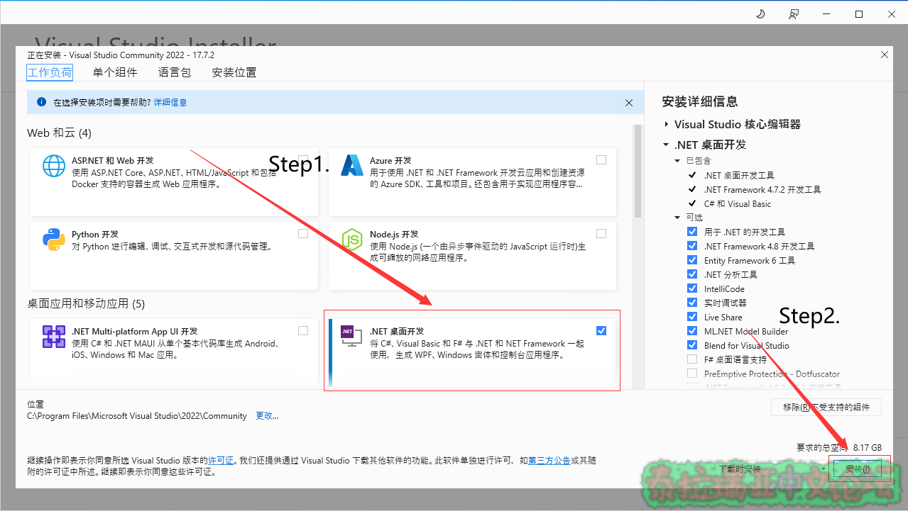
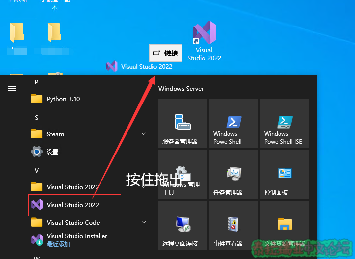

## Part 0.配置开发环境​

本章你将学到：  

* 如何安装Microsoft Visual Studio

### 1.下载Microsoft Visual Studio安装程序​

进入Visual Studio官方下载地址: <https://visualstudio.microsoft.com/zh-hans/downloads/>  
选择Community版本下载\(Professional、Enterprise版是付费版本\)  
  

### 2.打开VisualStudioSetup.exe​

点击继续即可，然后会开始安装VisualStudio安装器  

### 3.选择.NET 桌面开发并安装​

> 注: 请不要自以为是随便勾选组件和工作负载，每个工作负载都要占用相当大的储存空间。 修改安装位置可能导致一些玄学的安装问题，为了避免出现问题，请直接默认即可，如果你要修改部分安装设置，那么请你对你的修改有十足的把握！！！

  

### 4.等待安装​

> 注：若提示需要重启，重启即可

### 5.启动VisualStudio

VisualStudio一般会出现在开始菜单下，你可以使用如下方法创建快捷方式\(如果没有快捷方式\)  

  
初次启动可能会要求登录，登录完成后可以选择自定义主题\(~~反正我喜欢黑色主题~~\)，按照自己的偏好选择即可  
至此，VisualStudio安装教程结束
