## **Part 1.编写你的第一个插件**​

**本章你将学到：**  

* ****使用Visual Studio创建插件项目****
* ****使用Nuget程序包管理器添加插件依赖项****
* ****初步了解编写一个插件的流程****

### **1.创建新项目**​


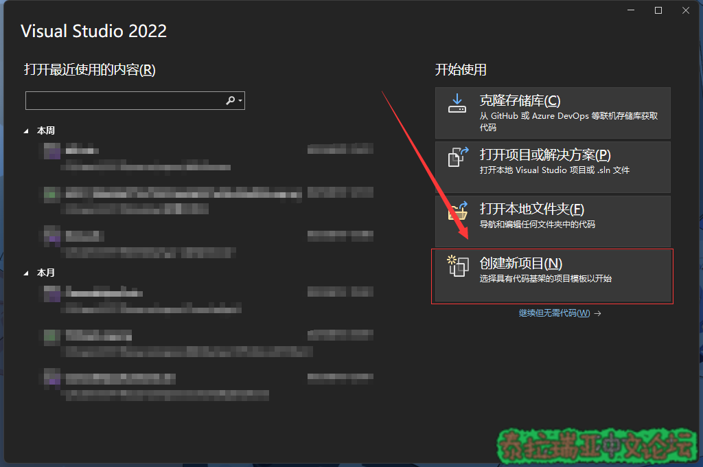

  
选择类库选项，然后下一步。 

> **注: 一定要看清楚是C#、.NET、库。**


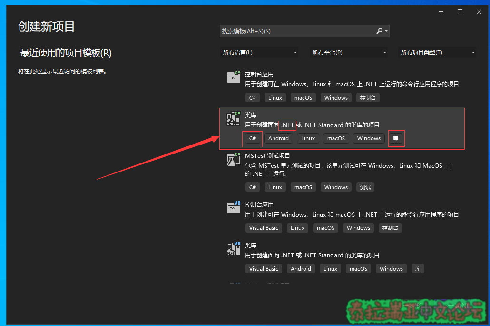

  
项目名称填写插件名，位置建议默认，具体可以参考下图配置**  

> **注：  
> 一般来讲，项目名只由字母\(A-Z,a-z\)，数字\(0-9\)，下划线\(\_\)组成，并且项目名具有实际意义**  
> 
> **不要使用中文！不要使用中文！不要使用中文！\(引自棱镜\)**​
> 
> **解决方案中可以包含多个插件项目。使用同一个解决方案存放多个插件项目可以方便管理多个插件代码，并且方便项目之间互相引用。**
> 
> [点击展开...](null)

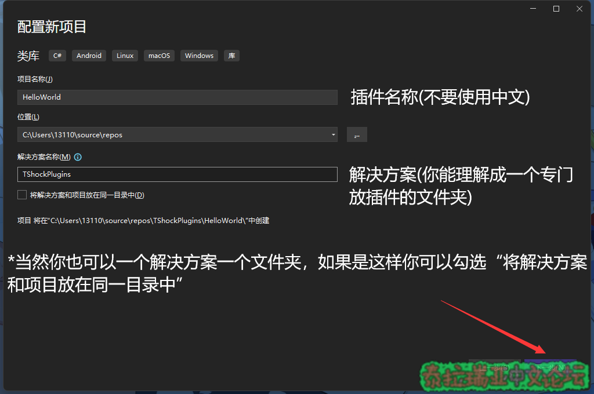

  
此处一定要选择.NET 6.0，否则可能会导致一些插件兼容问题  

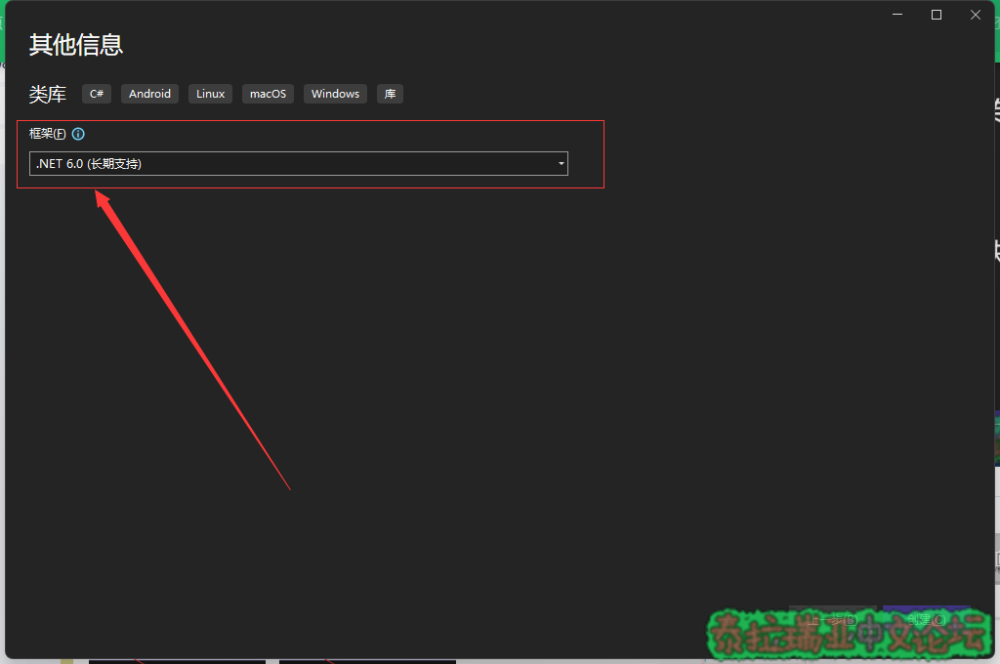


### **2.进入VS项目**​

**我相信有C#基础的你一定对VS的界面十分熟悉，所以不做过多介绍，但请你熟记下图的代码区域  

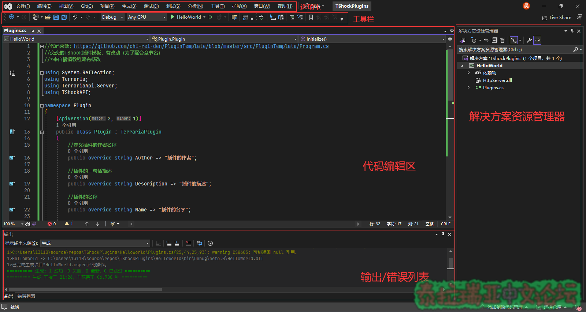

  
_\*重命名\(非必要\)_  
在解决方案资源管理器找到如图.cs文件可以对其右键进行重命名  
当然同样要遵循命名规范，不随意使用中文  

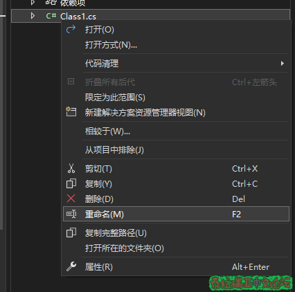


### **3.添加TShock插件依赖项**​

### **TShock插件依赖许多相关程序集，好消息是你可以通过NuGet程序包快速引用他们**​

**在解决方案资源管理器右键依赖项，点击管理NuGet程序包  

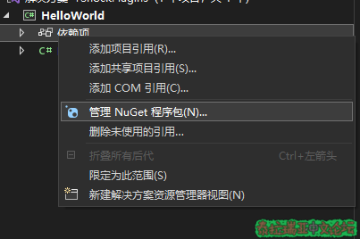

  
根据下图步骤安装TShock的NuGet程序包  

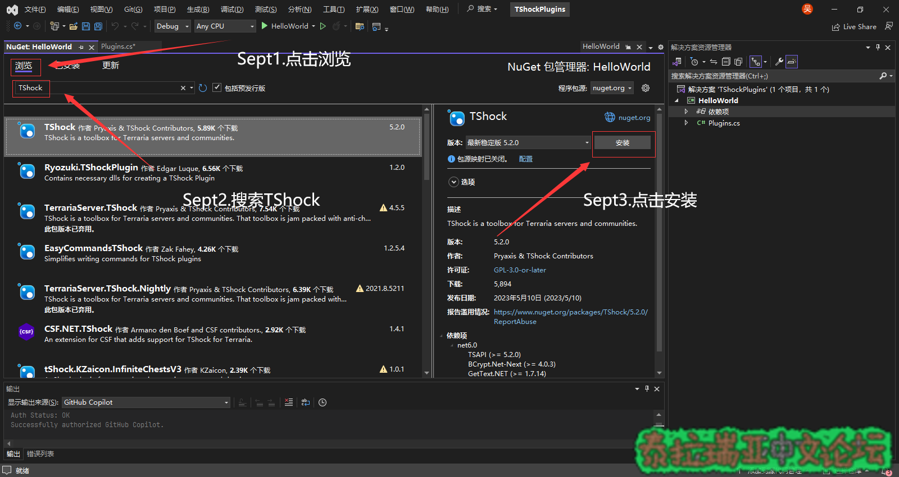

  
弹出提示点击确定、接受即可**  

### **4.开始编写代码**​

**显然你现在并不会写，但是你可以先复制下面的TShock插件模板  


```csharp
//代码来源：https://github.com/chi-rei-den/PluginTemplate/blob/master/src/PluginTemplate/Program.cs
//恋恋的TShock插件模板，有改动（为了配合章节名）
//来自棱镜的插件教程

using System;
using System.Collections.Generic;
using System.Reflection;
using Terraria;
using TerrariaApi.Server;
using TShockAPI;

namespace Plugin
{
    [ApiVersion(2, 1)]
    public class Plugin : TerrariaPlugin
    {
        //定义插件的作者名称
        public override string Author => "插件的作者";

        //插件的一句话描述
        public override string Description => "插件的描述";

        //插件的名称
        public override string Name => "插件的名字";

        //插件的版本
        public override Version Version => Assembly.GetExecutingAssembly().GetName().Version;

        //插件的构造器
        public Plugin(Main game) : base(game)
        {
        }

        //插件加载时执行的代码
        public override void Initialize()
        {
            //恋恋给出的模板代码中展示了如何为TShock添加一个指令
            Commands.ChatCommands.Add(new Command(
                permissions: new List<string> { "plugin.permission1", "plugin.permission2", },
                cmd: this.Cmd,
                "helloworld", "hw"));
        }
        
        //插件卸载时执行的代码

        protected override void Dispose(bool disposing)
        {
            if (disposing)
            {
                //移除所有由本插件添加的所有指令

                var asm = Assembly.GetExecutingAssembly();
                Commands.ChatCommands.RemoveAll(c => c.CommandDelegate.Method?.DeclaringType?.Assembly == asm);
            }
            base.Dispose(disposing);
        }

        //执行指令时对指令进行处理的方法
        private void Cmd(CommandArgs args)
        {
            args.Player.SendSuccessMessage("Hello world!");
        }
    }
}
```

相信你看到这串代码大概是一脸懵逼的，但是没关系，你只要知道它的功能是  
添加命令/helloworld，执行此命令会向执行命令的人发送一个绿色的HelloWorld！  

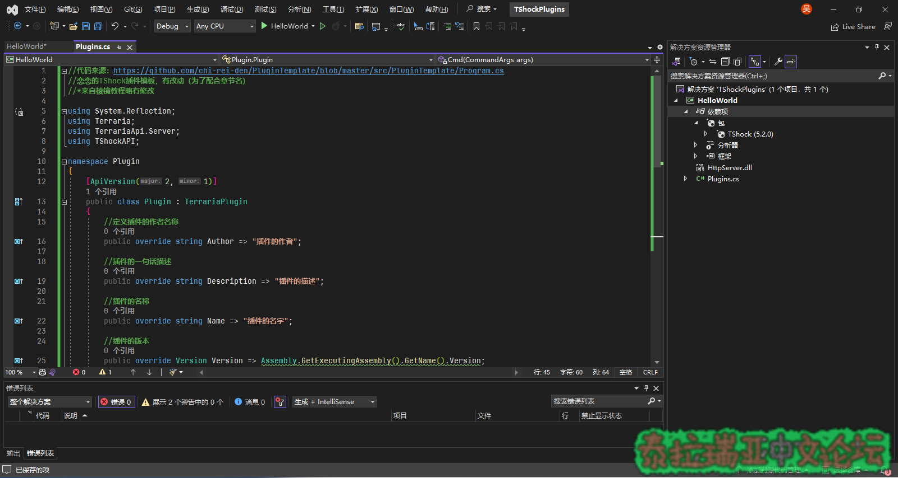

  
粘贴代码后，当你发现代码编辑区左下角的错误数已经变成0之后，恭喜你可以开始编译插件了  

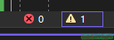


> **注:如果有错误存在，可能是你复制漏了某些地方。**


### **5.编译生成你的插件**​

**点击工具栏处的绿色小三角\(或者快捷键Ctrl+B\)即可开始编译  

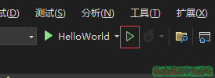

  
开始编译后，输出区会打印编译的一些日志，最后打印编译结果  
当出现"1 成功"的字样，说明插件代码已经成功编译了  

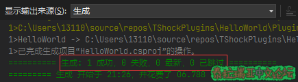


### **6.找到并安装你的插件**​

**在解决方案资源管理器右键当前项目\(HelloWorld\),点击在文件资源管理器中打开文件夹  

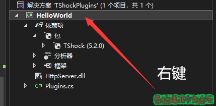

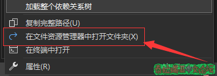

  
此时会蹦出一个文件夹，按照下图目录找到net6.0文件夹  

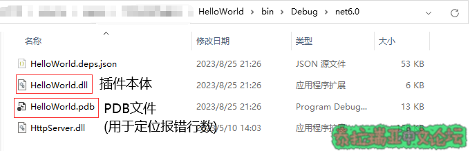

  
将图示两个文件移动或复制到TShock目录中的ServerPlugins文件夹中  

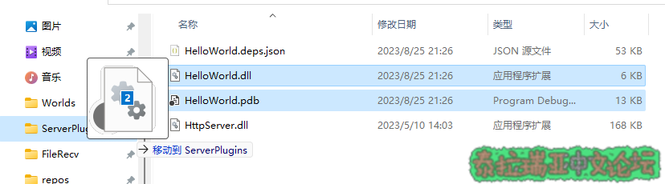

  
### **7.测试你的插件**​

**启动TShock，可以发现你的插件已经被TShock成功识别并安装了  
  

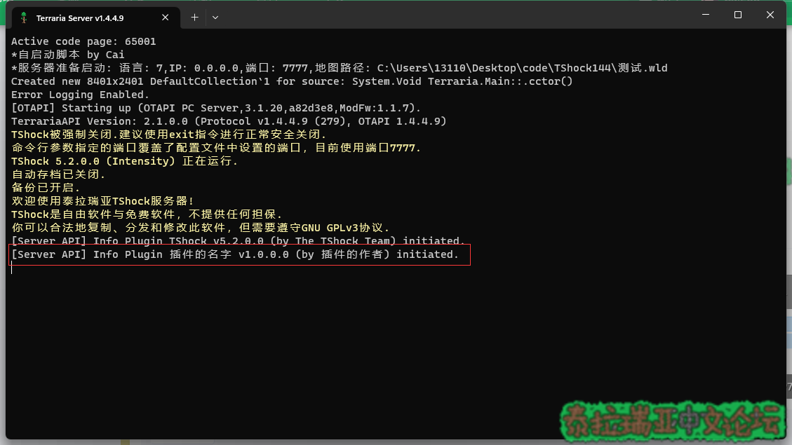

  
使用/help命令查看命令列表，可以发现插件添加的命令已经在命令列表中显示  
执行/helloworld，控制台打印出绿色Hello world\!  
说明插件功能正常  

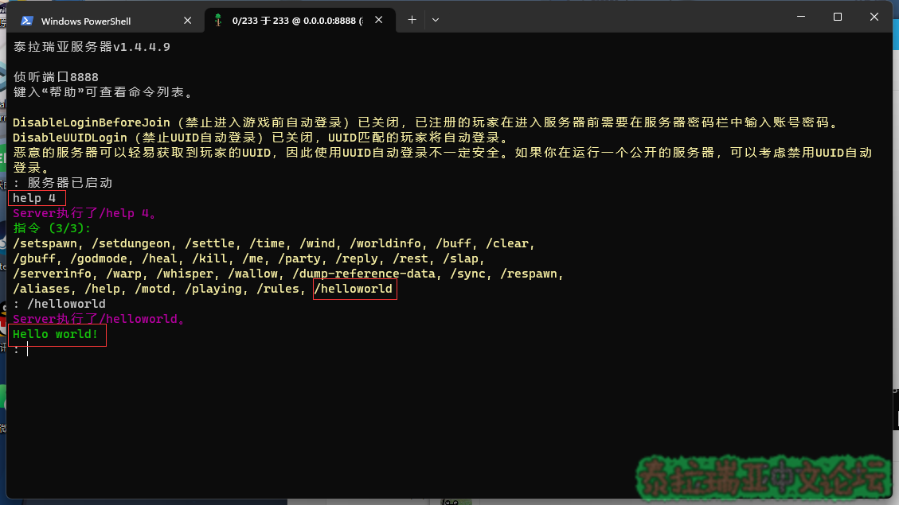
