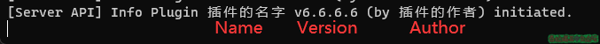
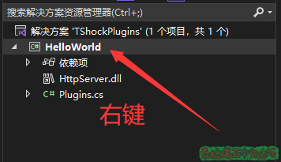
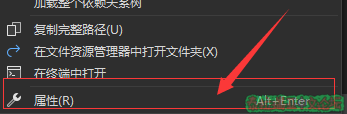
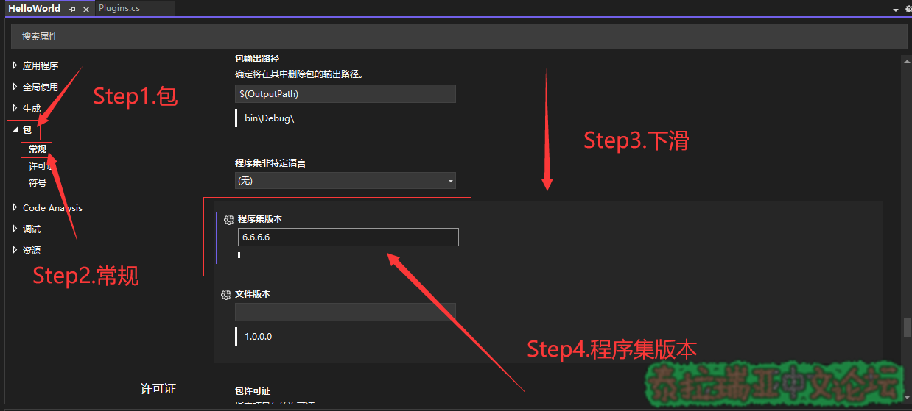
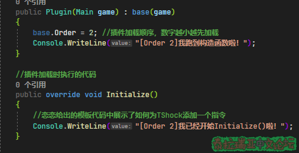
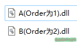
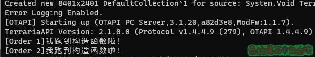
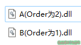
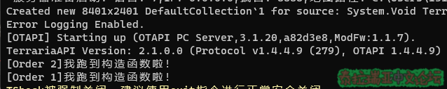
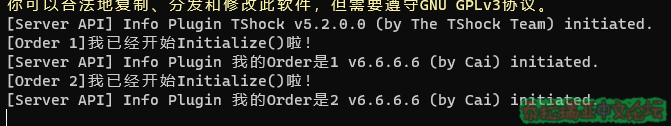

## Part 2.初步了解TShock插件模板​

本章你将学到：  

* TShock插件模板各部分的作用
* TShock插件的初始化顺序

### 插件模板​

以下是一个常用的TShock插件模板


```csharp
//代码来源：https://github.com/chi-rei-den/PluginTemplate/blob/master/src/PluginTemplate/Program.cs
//恋恋的TShock插件模板，有改动（为了配合章节名）
//来自棱镜的插件教程

using System;
using System.Collections.Generic;
using System.Reflection;
using Terraria;
using TerrariaApi.Server;
using TShockAPI;

namespace Plugin
{
    [ApiVersion(2, 1)]
    public class Plugin : TerrariaPlugin
    {
        //定义插件的作者名称
        public override string Author => "插件的作者";

        //插件的一句话描述
        public override string Description => "插件的描述";

        //插件的名称
        public override string Name => "插件的名字";

        //插件的版本
        public override Version Version => Assembly.GetExecutingAssembly().GetName().Version;

        //插件的构造器
        public Plugin(Main game) : base(game)
        {
        }

        //插件加载时执行的代码
        public override void Initialize()
        {
        }
        
        //插件卸载时执行的代码
        protected override void Dispose(bool disposing)
        {
            if (disposing)
            {
            }
            base.Dispose(disposing);
        }

    }
}
```


### 插件基本信息​
以下代码可以设置插件的一些基本信息，插件名建议按照功能命名，不要起奇怪名字\(例如"炸裂"\)  


```csharp
//定义插件的作者名称
public override string Author => "插件的作者";

//插件的一句话描述
public override string Description => "插件的描述";

//插件的名称
public override string Name => "插件的名字";

//插件的版本
public override Version Version => Assembly.GetExecutingAssembly().GetName().Version;
```

Author\(插件作者\)、Name\(插件名字\)、Version\(插件版本\)将会在插件初始化完成时显示  



  
其中，Version可以通过new Version修改，如下:  


```csharp
//插件的版本
public override Version Version => new Version(1, 0, 0, 0);
//public override Version Version => Assembly.GetExecutingAssembly().GetName().Version;
```

使用new Version\(\)将会显示此方法参数为版本号\(例如本例子中的"1.0.0.0"\)  
而使用Assembly.GetExecutingAssembly\(\).GetName\(\).Version获取的是程序集的版本号, 程序集版本号需要在项目属性中修改  

> 注: 如果你使用new Version\(\)作为版本号，将会以你Version\(\)的参数作为版本号，而不是程序集版本

<details>
  <summary>修改程序集版本</summary>
  1.右键解决方案资源管理器中的项目\(这里是HelloWorld\),然后点击属性  
    
    
    2.在属性选项卡中依次找到包—常规—程序集版本  
    
    3.修改程序集版本即可
</details>


### 插件的构造器​

插件的构造器，也叫构造函数，构造函数中的代码会比Initialize\(初始化\)函数更先执行  
服务端会先按照读取到插件的顺序\(取决于插件的文件名\)执行所有插件的构造函数，再按照Order\(等下会讲\)由小到大执行Initialize\(初始化\)函数  


```csharp
//插件的构造器
public Plugin(Main game) : base(game)
{
    base.Order = 1; //插件加载顺序，默认为1，数字越小越先加载
}
```

通常情况下，构造函数的执行会在TShock初始化之前，如果在构造函数中编写代码\(例如建表\)，可能会导致十分玄学的问题，  
所以没有特殊需要下一般插件的构造函数都会直接放空。  

#### 在构建函数中修改Order\(听不懂没事\)

构造函数常常会用来修改插件的初始化顺序—Order  
Order是一个int类型的整数，Order可以在取int类型范围内的任何数，当然也可以是负数  
Order越小插件的初始化就越优先，Order为1的插件会比Order为2的插件先初始化, TShock的Order为0，  
插件的Order在默认情况下\(不修改\)为1，而TShock的Order为0，所以TShock会比其他插件更先初始化  

<details>
  <summary>Order小实验</summary>
    1.编写两个插件，在执行构造函数和初始化函数执行时打印文本  
    
    2.重命名并安装插件  
    当Order为1的插件在文件夹中更靠前时\(以文件名排序\)，Order为1的插件的构造函数将会先被执行  
    
    
    
    相反，当Order为2的插件在文件夹中更靠前时\(以文件名排序\)，Order为2的插件的构造函数将会先被执行  
    
    
    所以，插件构造函数的执行顺序取决于插件的文件名，与Order无关  
    但是无论文件名如何修改，Order为1的插件总会先初始化，如下图:  
    
    所以，插件初始化函数的执行顺序取决于Order，与插件的文件名无关
</details>


### 插件的初始化函数​

初始化函数是TShock插件中非常重要的部分，这个函数主要负责插件的初始化，可以用来注册钩子、添加命令、注册REST API命令、初始化配置文件、初始化数据库等  


```csharp
//插件加载时执行的代码
public override void Initialize()
{
    ServerApi.Hooks.ServerChat.Register(this, this.OnChat); //注册钩子
    Commands.ChatCommands.Add(new Command(permissions: new List<string> {""}, cmd: this.Fish, "钓鱼排行")); //添加命令
    TShock.RestApi.Register(new SecureRestCommand("/XSB/GetMap", GetMap, "rest.xsb.admin")); //注册REST API命令
    Config.GetConfig(); //初始化配置文件
    DB.Connect(); //初始化数据库
}
```


### 插件的卸载函数​

相较于初始化函数，卸载函数显得
但是为了代码规范，还是建议你把注册过的钩子卸载，删除添加的命令  


```csharp
//插件卸载时执行的代码
protected override void Dispose(bool disposing)
{
     if (disposing)
     {
         ServerApi.Hooks.ServerChat.Deregister(this, this.OnChat);  //卸载钩子
         Commands.ChatCommands.RemoveAll(c => c.CommandDelegate.Method?.DeclaringType?.Assembly == Assembly.GetExecutingAssembly());
         //移除插件添加的命令
     }
     base.Dispose(disposing);
}
```