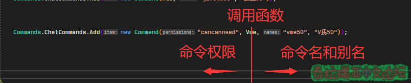

## **Part 3.添加新命令**​

**本章你将学到：**  

- **如何在TShock插件中添加新命令**
- ****学会处理CommandArgs参数****
- ****学会卸载插件添加的命令****~~\(养成好习惯\)~~

### **1.添加新的命令**​

在Part 1中有提到，添加命令通常是在插件的初始化函数Initialize\(\)中添加的
添加新命令的常用格式是这样的:  


```csharp
public override void Initialize()
{
    Commands.ChatCommands.Add(new Command("mycommand", Cmd, "cmd2"));
    //Command()中第一个参数是权限名，第二个参数是回调函数，第三个参数是命令名
}
```

当你输入代码后由于没有相应的函数\(Cmd\)会报错，  


  
此时我们右键我们需要创建的函数名，然后选择快速操作和重构，


  
然后选择生成方法"Cmd"  


  
此时Visual Studio就会自动帮我们创造一个回调函数  


  
当然，此时这个函数没有任何功能，我们删去throw new NotImplementedException\(\);就可以开始编写命令功能了  

### **2.命令的权限**​


```csharp
public override void Initialize()
{
    Commands.ChatCommands.Add(new Command("mycommand", Cmd, "cmd2"));
}


private void Cmd(CommandArgs args)
{
    args.Player.SendSuccessMessage("你使用了cmd2命令!");
}
```

上面的示例代码中，当玩家输入"/cmd2"命令并且拥有"mycommand"权限时，就会向玩家发送一条绿色的消息，内容为"你使用了cmd2命令\!"，若玩家没有相应权限则会提示玩家无权执行该命令，并且日志会记录玩家试图执行命令的行为并发送给打开接受日志的玩家


  
权限也可以设为无或者多个权限，**如下代码可以添加3条分别为/cmd1\(无权限\)、/cmd2\(单权限\)、/cmd3\(多权限\)的命令**  


```csharp
public override void Initialize()
{
    Commands.ChatCommands.Add(new Command(Cmd, "cmd1")); //不设置权限
    Commands.ChatCommands.Add(new Command("mycommand", Cmd, "cmd2")); //设置一个权限
    Commands.ChatCommands.Add(new Command(new List<string> { "mycommand","mycommand2" }, Cmd, "cmd3")); //设置多个权限
}
```

执行上面的命令，都会调用"Cmd"函数，他们的区别在于权限，权限区别请见下表:  

<table style="width: 100%"><tbody><tr><td><span style="color: rgb(61, 142, 185)">/cmd1</span></td><td><span style="color: rgb(243, 121, 52)">无权限限制</span></td></tr><tr><td><span style="color: rgb(61, 142, 185)">/cmd2</span></td><td><span style="color: rgb(0, 0, 0)">玩家需要拥有</span><span style="color: rgb(243, 121, 52)">mycommand权限</span></td></tr><tr><td><span style="color: rgb(61, 142, 185)">/cmd3</span></td><td>玩家需要拥有<span style="color: rgb(243, 121, 52)">mycommand</span><span style="color: rgb(226, 80, 65)"><span style="font-size: 22px">或者</span></span><span style="color: rgb(243, 121, 52)">mycommand2权限</span></td></tr></tbody></table>

注: 像/cmd3类似的多权限命令，只要玩家拥有命令中设置的任何一个权限，玩家就可以执行对应的命令  
\*权限的命名  
权限的命名是需要遵循一定的命名规范的并_不能像上面代码中随便命名_  
通常插件权限名字格式应为: 插件名.功能名\(例如: si.use\)  
当然为了方便分类也可以使用: 插件名.功能.功能细分 \(例如: uban.playerban.admin\)  

### **3.命令的别名**​

有时候一个命令可以由两个名字对应，例如：/off和/exit他们属于同一个命令，/exit就是/off的别名  
我们可以通过下面的代码实现命令别名  


```csharp
public override void Initialize()
{
    Commands.ChatCommands.Add(new Command("cancanneed", Vme, "vme50", "v我50"));
}
private void Vme(CommandArgs args)
{
    args.Player.GiveItem(74, 50, 0); //给玩家50个铂金币
}
```

上述代码中，当玩家使用/vme50或者/v我50且有"cancanneed"权限，就会给予这个玩家50铂金币  
此时"/v我50"就是"/vme50"的别名  
同样即使你使用别名，你仍然可以使用那几个权限的重载，就像如下示例:  


```csharp
public override void Initialize()
{
    Commands.ChatCommands.Add(new Command(Vme, "giveme50", "送我50"));
    Commands.ChatCommands.Add(new Command("cancanneed", Vme, "vme50", "V我50"));
    Commands.ChatCommands.Add(new Command(new List<string> { "乞丐" , "beggar" } , Vme, "begme50", "乞讨50"));
}
```

### 小结: 你可以把记作回调函数\(例如Vme\)就像一条分界线，回调函数左侧的是权限\(就像"cancanneed"\)，回调函数右侧的是名字\(就像"vme50"、"V我50"\)



### **4.命令的其他属性**​

TShock的命令还有4个属性，这些属性是AllowServer、DoLog、HelpDesc、HelpText，你可以使用new Command\(\)\{ 属性 = 值 \}来修改他们，也可以用如下方法一次修改多个属性  


```csharp
public override void Initialize()
{
    Commands.ChatCommands.Add(new Command(Vme, "giveme50", "送我50")
    { AllowServer = false,DoLog=true, HelpDesc = new string[]{ "帮助文档","这是第一行"}, HelpText= "帮助文本"});
}
```

#### AllowServer​

默认为true，AllowServer被设置为false时，非真实玩家\(服务器后台、REST远程命令\)无法使用这个命令  


  

#### DoLog​

默认为true，当你设置为false时，服务器日志不会记录执行该命令的具体参数，只会记录命令名\(例如：使用命令/login 123456，只会记录/login\)  


  

#### HelpDesc和HelpText​

HelpDesc的默认值为null，HelpText的默认值为No help available.\(在当前设置的语言有效时会被设为对应语言的翻译\)  
这两者基本一样，都是命令帮助文档，使用/help 命令名可以查看  
但是HelpDesc的优先级会更高，当命令的HelpDesc不为null时只会显示HelpDesc  


### **5.CommandArgs参数**​

**当玩家执行我们添加的命令时，服务器会把一些相关的信息"打包"传给我们的回调函数，这些信息就是CommandArgs  


  
它包含Message、Player\(重要\)、TPlayer、Silent、Parameters\(重要\)  


#### **Parameters**​

**当你输入含有参数的命令时，TShock会把命令分割成Parameters**  

#### **Parameters是命令的参数，类型为字符串列表**​


  
你可以使用switch-case结构实现子命令功能，示例如下：  


```csharp
//代码来自Cai的SSC管理器

private void CommandHandler(CommandArgs args)
{
    if (args.Parameters.Count == 0)
    {
        args.Player.SendErrorMessage("无效的SSC管理器子命令!有效命令如下:\n" +
                "ssc save [ID]--保存SSC\n" +
                "ssc del [ID]--删除SSC\n" +
                "ssc list --列出SSC\n" +
                "ssc restore --复原SSC");
        return;
    }
    int sscid = -1;
    switch (args.Parameters[0].ToLower())
    {
        case "保存":
        case "save":
            if (args.Parameters.Count != 2 || !int.TryParse(args.Parameters[1], out sscid))
            {
                args.Player.SendErrorMessage("用法错误!正确用法:ssc save [ID]");
                return;
            }


            if (SSCDB.InsertPlayerData(args.Player, sscid))
            {
                args.Player.SendSuccessMessage("保存成功!");
                return;
            }
            args.Player.SendErrorMessage("保存失败!");
            break;
        case "删除":
        case "del":
            if (args.Parameters.Count != 2 || !int.TryParse(args.Parameters[1], out sscid))
            {
                args.Player.SendErrorMessage("用法错误!正确用法:ssc del [ID]");
                return;
            }
            if (!SSCDB.GetPlayerData(sscid).exists)
            {
                args.Player.SendErrorMessage("你输入的SSC背包ID不存在!");
                return;
            }
            if (SSCDB.DeletePlayerData(sscid))
            {
                args.Player.SendSuccessMessage("删除成功!");
                return;
            }
            args.Player.SendErrorMessage("删除失败!");
            break;
        case "列出":
        case "list":
            args.Player.SendSuccessMessage("有效的SSC背包列表:" + string.Join(',', SSCDB.GetAllSSCId()));
            break;
        case "还原背包":
        case "restore":
            if (args.Parameters.Count != 2 || !int.TryParse(args.Parameters[1], out sscid))
            {
                args.Player.SendErrorMessage("用法错误!正确用法:ssc restore [ID]");
                return;
            }
            if (!SSCDB.GetPlayerData(sscid).exists)
            {
                args.Player.SendErrorMessage("你输入的SSC背包ID不存在!");
                return;
            }
            args.Player.PlayerData = SSCDB.GetPlayerData(sscid);
            args.Player.PlayerData.RestoreCharacter(args.Player);
            args.Player.Heal(args.Player.PlayerData.maxHealth);
            args.Player.SendSuccessMessage("背包已还原!");
            break;
        default:
            args.Player.SendErrorMessage("无效的SSC管理器子命令!有效命令如下:\n" +
                "ssc save [ID]--保存SSC\n" +
                "ssc del [ID]--删除SSC\n" +
                "ssc list --列出SSC\n" +
                "ssc restore --复原SSC");
            break;
    }
}
```


#### **Player**​

执行命令的玩家的TSPlayer对象，通常可以对其进行以下操作：  


```csharp
args.Player.SendData(PacketTypes.WorldInfo); //发送数据包,根据NetMessage发送数据包
args.Player.SendRawData(new byte[] { }); //发送原始数据，即手搓数据包
args.Player.SendErrorMessage("这是一个错误信息"); //发送错误信息(红色)
args.Player.SendInfoMessage("这是一个信息"); //发送信息(黄色)
args.Player.SendSuccessMessage("这是一个成功信息"); //发送成功信息(绿色)
args.Player.SendWarningMessage("这是一个警告信息"); //发送警告信息(橙色)
args.Player.Kick("这是一个踢出信息",true,true,"Cai",false);
//踢出玩家(踢出理由，强制踢出，不发送广播，踢出用户名，保存玩家的存档)
args.Player.Ban("这是一个封禁信息","Cai"); //封禁玩家(封禁理由，封禁用户名)
args.Player.SetTeam(1); //设置玩家队伍，无队伍0，红队1，绿队2，蓝队3，黄队4，粉队5
args.Player.SetBuff(1, 1); //添加玩家Buff (BuffID,Buff持续时间(单位1/60s))
args.Player.Teleport(1, 1); //传送玩家到坐标(X,Y)
args.Player.Disconnect("这是一个断开信息"); //断开玩家的连接(断开理由)(也算是踢出玩家的一种)
```

~~将会在未来的几个Part更详细地讲解TSplayer\(画大饼\)~~

#### **TPlayer**​

**Player对象，即Terraria原版玩家对象，~~过于硬核~~，此处不讲解**  

#### **Silent**​

**是否为静默执行，  
当玩家使用CommandSpecifier\(默认为/\)为命令起始符时Silent为false  
当玩家使用CommandSilentSpecifier\(默认为.\)为命令起始符时Silent为true  
静默执行取决于命令是否写了静默执行的逻辑，如果没有，那么静默执行和正常执行没有任何区别**  

#### **Message**​

**原消息，例如：你执行了/kick Cai 傻逼，那么Message的值就是"kick Cai 傻逼"  
由于Parameters的存在，~~这个东西就基本上没啥卵用~~**  
  

### **5.卸载你添加的命令**​

**使用下面的代码就可以卸载本插件添加的**所有**命令**  


```csharp
protected override void Dispose(bool disposing)
{
    if (disposing)
    {
        //移除所有由本插件添加的所有指令
        var asm = Assembly.GetExecutingAssembly();
        Commands.ChatCommands.RemoveAll(c => c.CommandDelegate.Method?.DeclaringType?.Assembly == asm);
    }
    base.Dispose(disposing);
}
```