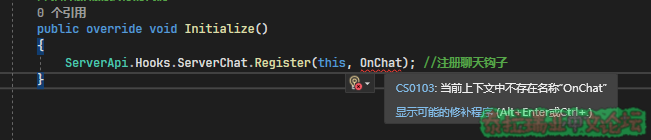

## Part 4.挂钩钩\~

本章你将学到：  

- 学习如何注册、卸载钩子
- 学会使用常用钩子修改游戏事件

### 钩子可以干啥？

当你注册一个事件的钩子后，在触发这个事件时，钩子就会执行你预先设置的函数\(回调函数\)  

### 举个例子：

假如你需要实现当玩家说脏话时把他踢出去，那么你就可以注册一个ServerChat钩子，并且调用OnChat函数。你需要在OnChat函数中编写代码，识别玩家是不是真的说了脏话。最后别忘了卸载你的钩子~~\(好习惯\)~~  


```csharp
//以下为示例代码，看不懂没事，我们慢慢学
using System.Reflection;
using Terraria;
using TerrariaApi.Server;
using TShockAPI;


namespace Plugin
{
    [ApiVersion(2, 1)]
    public class Plugin : TerrariaPlugin
    {
        //定义插件的作者名称
        public override string Author => "Cai";


        //插件的一句话描述
        public override string Description => "拒绝脏话";


        //插件的名称
        public override string Name => "Fuck";


        //插件的版本
        public override Version Version => Assembly.GetExecutingAssembly().GetName().Version;


        //插件的构造器
        public Plugin(Main game) : base(game)
        {
        }


        //插件加载时执行的代码
        public override void Initialize()
        {
            ServerApi.Hooks.ServerChat.Register(this, OnChat); //注册聊天钩子
        }


        private void OnChat(ServerChatEventArgs args)
        {
            TSPlayer plr = TShock.Players[args.Who]; //获取TShock玩家对象
            if (args.Text.Contains("wdnmd")) //检测聊天是否含有脏话"wdnmd"
            {
                plr.Kick("不许说脏脏！", true); //踢出玩家
            }
        }


        //插件卸载时执行的代码
        protected override void Dispose(bool disposing)
        {
            if (disposing)
            {
                ServerApi.Hooks.ServerChat.Deregister(this, OnChat); //卸载聊天钩子
            }
            base.Dispose(disposing);
        }


    }
}
```


### 代码解析：

•注册钩子语句  
不同类型的钩子有不同的注册语句，  
ServerApi.Hooks.ServerChat.Register\(this, _OnChat_\); 就是ServerApi钩子的注册语句，钩子要在使用前注册\(一般在Initialize注册\)  
绿字部分是钩子的名字\(一般和其功能有关\)，划线部分是其回调函数\(触发钩子执行的函数\)，其他照写就好  


```csharp
//插件加载时执行的代码
public override void Initialize()
{
    ServerApi.Hooks.ServerChat.Register(this, OnChat); //注册聊天钩子
}
```

•卸载钩子语句  
不同类型的钩子有不同的卸载语句，  
ServerApi.Hooks.ServerChat.Deregister\(this, _OnChat_\); 就是ServerApi钩子的卸载语句，钩子要在不需要使用时卸载\(一般在Dispose卸载\)  
绿字部分是钩子的名字\(一般和其功能有关\)，划线部分是其回调函数\(和注册钩子的函数名一样\)，值得注意的是卸载函数是Deregister\(\)而不是注册时的Register\(\)  


```csharp
//插件卸载时执行的代码
protected override void Dispose(bool disposing)
{
    if (disposing)
    {
        ServerApi.Hooks.ServerChat.Deregister(this, OnChat); //卸载聊天钩子
    }
    base.Dispose(disposing);
}
```

•回调函数  
回调函数是触发钩子时执行的函数，创建方法类似命令的回调函数  
1.右键函数名字\(自己起名字\)  



  
2.点击快速操作和重构...  


  
3.点击生成方法  


  
4.然后就会发现Visual Studio自动生成了一个回调函数，你需要自行编写函数的逻辑  


### 常用钩子​

•ServerApi钩子  
ServerApi的钩子覆盖了服务器大部分可能需要挂钩的事件，同时值得注意的是ServerApi钩子中参数的命名和Terraria原版相似  


```csharp
//插件加载时执行的代码
public override void Initialize()
{
    ServerApi.Hooks.ServerChat.Register(this, OnChat); //注册ServerApi钩子(玩家聊天)
}
//回调函数
private void OnChat(ServerChatEventArgs args)
{
           
}
//插件卸载时执行的代码
protected override void Dispose(bool disposing)
{
    if (disposing)
    {
        ServerApi.Hooks.ServerChat.Deregister(this, OnChat); //卸载ServerApi钩子(玩家聊天)
    }
    base.Dispose(disposing);
}
```

其中args参数中是不包含TSPlayer对象或Player对象的，所以你需要手动获取，方法如下:  


```csharp
private void OnChat(ServerChatEventArgs args)
{
    //args.Who(有的地方是WhoAmI)是玩家索引的意思，也就是在玩家对象数组中的下标(索引)。Who和WhoAmI等同于TSPlayer中的Index，Who和WhoAmI也可能表示的是生物(NPC)或者弹幕(Projectile)等的索引，这要取决于你的钩子
    //TShock.Players是TShock玩家对象(TSPlayer)数组，TShock玩家对象中的绝大部分属性、变量、方法都为插件编写服务，大部分都可以在服务端使用
    //Main.player是Terraria玩家对象(Player)数组，Terraria玩家对象是Terraria客服端和服务端都使用的，所以其中的属性、变量、方法在服务器中可能不会生效
    TSPlayer plr = TShock.Players[args.Who]; //获取TShock玩家对象，说白点就是用下标获取数组元素
    Player player = Main.player[args.Who]; //获取TShock玩家对象
}
```


> 注：args.Handled可以标记这个事件是否已经处理，如果将其设为true服务器可能会忽略这个事件

•TShockAPI钩子  
这些钩子主要挂钩了TShock中的事件，例如：新建账号、玩家进入区域等，TShockAPI钩子分为如下几类:  

 类型 | 包含钩子 
-------|----------
 AccountHooks | AccountCreate\(创建账号\)、AccountDelete\(删除账号\) 
 PlayerHooks | PlayerChat\(玩家聊天\)、PlayerCommand\(玩家执行命令\)、PlayerLogout\(玩家登出\)、PlayerPreLogin\(玩家登录前\)、PlayerPostLogin\(玩家登录后\)、PlayerPermission\(权限检查\)、PlayerHasBuildPermission\(玩家建筑权限检查\)、PlayerProjbanPermission\(玩家服务器忽略禁用弹幕权限检查\)、  PlayerTilebanPermission\(玩家服务器忽略禁用图格权限检查\)、  PlayerItembanPermission\(玩家服务器忽略违禁物品权限检查\) 
 GeneralHooks | ReloadEvent\(服务器重载\[使用/reload命令\]\) |
 RegionHooks | RegionCreated\(区域创建\)、RegionDeleted\(区域删除\)、RegionRenamed\(区域重命名\)、RegionEntered\(玩家进入区域\)、  RegionLeft\(玩家离开区域\) 

TShockAPI钩子使用方法:  


```csharp
//插件加载时执行的代码
public override void Initialize()
{
    TShockAPI.Hooks.AccountHooks.AccountCreate += AccountHooks_AccountCreate;//注册TShockAPI钩子(玩家创建账号)
}

//回调函数
private void AccountHooks_AccountCreate(TShockAPI.Hooks.AccountCreateEventArgs e)
{
    TShock.Utils.Broadcast($"[欢迎新人]{e.Account.Name}注册了新账号，快举小花欢迎吧~", 0, 255, 120); //发送全服广播
}

//插件卸载时执行的代码
protected override void Dispose(bool disposing)
{
    if (disposing)
    {
        TShockAPI.Hooks.AccountHooks.AccountCreate -= AccountHooks_AccountCreate; ; //卸载TShockAPI钩子(玩家创建账号)
    }
    base.Dispose(disposing);
}
```

  
•GetDataHandlers数据包钩子  
服务器会收到客户端发送的数据包，而GetDataHandlers钩子会解析这些数据包，触发对应的数据包钩子，并且打包成参数传入回调函数，但是GetDataHandlers并不包含所有数据包。  


```csharp
//插件加载时执行的代码
public override void Initialize()
{
    GetDataHandlers.KillMe.Register(OnKillPlayer); //注册GetDataHandlers数据包钩子(玩家死亡)
}
//回调函数
private void OnKillPlayer(object? sender, GetDataHandlers.KillMeEventArgs e)
{
    TShock.Utils.Broadcast($"[死亡]{e.Player.Name}挂掉啦，快来嘲笑他吧!", 0, 255, 120); //发送全服广播
    e.Handled = false; //是否处理这个事件，默认为false，如果你标记为true，这个事件将会被忽略，会导致TShock直接忽略这个玩家死亡(不进行重生倒计时)
}

//插件卸载时执行的代码
protected override void Dispose(bool disposing)
{
    if (disposing)
    {
        GetDataHandlers.KillMe.UnRegister(OnKillPlayer); //卸载GetDataHandlers数据包钩子(玩家死亡)
    }
    base.Dispose(disposing);
}
```


> 注：args.Handled可以标记这个事件是否已经处理，如果将其设为true服务器可能会忽略这个事件


除此之外，还有On钩子和IL钩子，将在以后填坑...

### 钩子练习题​

1\. 使用ServerApi钩子实现，在玩家加入服务器时\(ServerJoin,ServerLeave\)广播"欢迎玩家XXX加入服务器\!"，在玩家离开服务器时广播"玩家XXX离开服务器\!"  
提示: 可以使用如下语句获取TShock玩家对象  


```csharp
TSPlayer plr = TShock.Players[args.Who]; //获取TShock玩家对象，args.Who是玩家的索引
```

<details>
<summary>参考答案</summary>
    

    ```csharp
    using System.Reflection;
    using Terraria;
    using TerrariaApi.Server;
    using TShockAPI;

    namespace Plugin
    {
        [ApiVersion(2, 1)]
        public class Plugin : TerrariaPlugin
        {
            //定义插件的作者名称
            public override string Author => "Cai";

            //插件的一句话描述
            public override string Description => "钩子测试";

            //插件的名称
            public override string Name => "Hooks";

            //插件的版本
            public override Version Version => Assembly.GetExecutingAssembly().GetName().Version;

            //插件的构造器
            public Plugin(Main game) : base(game)
            {
            }

            //插件加载时执行的代码
            public override void Initialize()
            {
                ServerApi.Hooks.ServerJoin.Register(this, OnJoin); //注册钩子
                ServerApi.Hooks.ServerLeave.Register(this, OnLeave);
            }
            private void OnJoin(JoinEventArgs args)
            {
                TSPlayer plr = TShock.Players[args.Who]; //获取TShock玩家对象，args.Who是玩家的索引
                TShock.Utils.Broadcast($"欢迎玩家{plr.Name}加入服务器!", 255, 255, 255); //发送广播Broadcast(内容,R,G,B) R,G,B是对应的RGB颜色代码
            }
            private void OnLeave(LeaveEventArgs args)
            {
                TSPlayer plr = TShock.Players[args.Who]; //获取TShock玩家对象，args.Who是玩家的索引
                TShock.Utils.Broadcast($"玩家{plr.Name}离开服务器!", 255, 255, 255); //发送广播Broadcast(内容,R,G,B) R,G,B是对应的RGB颜色代码
            }

            //插件卸载时执行的代码
            protected override void Dispose(bool disposing)
            {
                if (disposing)
                {
                    ServerApi.Hooks.ServerJoin.Deregister(this, OnJoin); //注销钩子
                    ServerApi.Hooks.ServerLeave.Deregister(this, OnLeave);
                }
                base.Dispose(disposing);
            }
        }
    }
    ```
</details>


2\. 使用ServerApi钩子实现，在服务器加载完成后\(GamePostInitialize\)在控制台打印"服务器已经加载完啦\!"  
GameInitialize和GamePostInitialize的区别：  
他们都是游戏初始化钩子，但是GameInitialize是开始初始化时触发，而GamePostInitialize是完成初始化时触发\(即地图加载完毕，服务器处于可加入状态\)  


```csharp
ServerApi.Hooks.GameInitialize.Register(this,(args) => { Console.WriteLine("触发GameInitialize"); });
ServerApi.Hooks.GamePostInitialize.Register(this,(args) => { Console.WriteLine("触发GamePostInitialize"); });
```


  

<details>
<summary>参考答案</summary>

```csharp
using System.Reflection;
using Terraria;
using TerrariaApi.Server;
using TShockAPI;

namespace Plugin
{
    [ApiVersion(2, 1)]
    public class Plugin : TerrariaPlugin
    {
        //定义插件的作者名称
        public override string Author => "Cai";

        //插件的一句话描述
        public override string Description => "钩子测试";

        //插件的名称
        public override string Name => "Hooks";

        //插件的版本
        public override Version Version => Assembly.GetExecutingAssembly().GetName().Version;

        //插件的构造器
        public Plugin(Main game) : base(game)
        {
        }

        //插件加载时执行的代码
        public override void Initialize()
        {
            ServerApi.Hooks.GamePostInitialize.Register(this, OnGamePostInitialize); //注册钩子
        }

        private void OnGamePostInitialize(EventArgs args)
        {
            Console.WriteLine("服务器已经加载完啦!");
        }

        //插件卸载时执行的代码
        protected override void Dispose(bool disposing)
        {
            if (disposing)
            {
                ServerApi.Hooks.GamePostInitialize.Deregister(this, OnGamePostInitialize); //卸载钩子
            }
            base.Dispose(disposing);
        }
    }
}
```
</details>


3\. 使用TShockAPI钩子实现，在玩家完成登录后\(PlayerHooks.PlayerPostLogin\) 给玩家发送"您登录的IP是：xxx.xxx.xxx.xxx"  
提示: 可以使用如下语句获取玩家IP  


```csharp
string ip = e.Player.IP;
```

<details>
<summary>参考答案</summary>

```csharp
using System.Reflection;
using Terraria;
using TerrariaApi.Server;
using TShockAPI;
using TShockAPI.Hooks;


namespace Plugin
{
    [ApiVersion(2, 1)]
    public class Plugin : TerrariaPlugin
    {
        //定义插件的作者名称
        public override string Author => "Cai";

        //插件的一句话描述
        public override string Description => "钩子测试";

        //插件的名称
        public override string Name => "Hooks";

        //插件的版本
        public override Version Version => Assembly.GetExecutingAssembly().GetName().Version;

        //插件的构造器
        public Plugin(Main game) : base(game)
        {
        }

        //插件加载时执行的代码
        public override void Initialize()
        {
            PlayerHooks.PlayerPostLogin += PlayerHooks_PlayerPostLogin;  //注册钩子
        }

        private void PlayerHooks_PlayerPostLogin(PlayerPostLoginEventArgs e)
        {
            e.Player.SendSuccessMessage($"您的登录IP是：{e.Player.IP}");
        }

        //插件卸载时执行的代码
        protected override void Dispose(bool disposing)
        {
            if (disposing)
            {
                PlayerHooks.PlayerPostLogin -= PlayerHooks_PlayerPostLogin;  //注销钩子
            }
            base.Dispose(disposing);
        }
    }
}
```
</details>


4\. 使用TShockAPI钩子实现，在服务器使用/reload命令\(GeneralHooks.ReloadEvent\)后显示"服务器正在重载\!"  
重点: Reload钩子非常重要，可以让你用/reload统一重载插件  

<details>
<summary>参考答案</summary>

```csharp
using System.Reflection;
using Terraria;
using TerrariaApi.Server;
using TShockAPI;
using TShockAPI.Hooks;

namespace Plugin
{
    [ApiVersion(2, 1)]
    public class Plugin : TerrariaPlugin
    {
        //定义插件的作者名称
        public override string Author => "Cai";

        //插件的一句话描述
        public override string Description => "钩子测试";

        //插件的名称
        public override string Name => "Hooks";

        //插件的版本
        public override Version Version => Assembly.GetExecutingAssembly().GetName().Version;

        //插件的构造器
        public Plugin(Main game) : base(game)
        {
        }

        //插件加载时执行的代码
        public override void Initialize()
        {
            GeneralHooks.ReloadEvent += GeneralHooks_ReloadEvent;
        }

        private void GeneralHooks_ReloadEvent(ReloadEventArgs e)
        {
            //这个钩子非常常用，可以让你用/reload统一重载插件
            TSPlayer.All.SendWarningMessage("服务器正在重载!!!"); //这是发送全服广播的另一种方法，TSPlayer.All对象可以代表全服所有玩家
            //上面代码也可以换为
            //TShock.Utils.Broadcast("服务器正在重载!!!",255,135,0);
        }

        //插件卸载时执行的代码
        protected override void Dispose(bool disposing)
        {
            if (disposing)
            {
                GeneralHooks.ReloadEvent -= GeneralHooks_ReloadEvent;
            }
            base.Dispose(disposing);
        }
    }
}
```
</details>

5\. 使用GetDataHandlers实现，在玩家打开箱子时\(GetDataHandlers.ChestOpen\)广播"玩家XXX打开了箱子XXX位于\(X, Y\)"  
提示: 用以下代码可以获取箱子对象  


```csharp
int chestIndex = Chest.FindChest(e.X,e.Y); //找到箱子的索引
Chest chest = Main.chest[chestIndex]; //获取箱子对象
//箱子名称: chest.name, 箱子X坐标: chest.x, 箱子Y坐标: chest.y, 箱子物品数组: chest.item
```

<details>
<summary>参考答案</summary>

```csharp
using System.Reflection;
using Terraria;
using TerrariaApi.Server;
using TShockAPI;
using TShockAPI.Hooks;

namespace Plugin
{
    [ApiVersion(2, 1)]
    public class Plugin : TerrariaPlugin
    {
        //定义插件的作者名称
        public override string Author => "Cai";

        //插件的一句话描述
        public override string Description => "钩子测试";

        //插件的名称
        public override string Name => "Hooks";

        //插件的版本
        public override Version Version => Assembly.GetExecutingAssembly().GetName().Version;

        //插件的构造器
        public Plugin(Main game) : base(game)
        {
        }

        //插件加载时执行的代码
        public override void Initialize()
        {
            GetDataHandlers.ChestOpen.Register(ChestOpen); //注册钩子
        }

        private void ChestOpen(object? sender, GetDataHandlers.ChestOpenEventArgs e)
        {
            int chestIndex = Chest.FindChest(e.X,e.Y); //找到箱子的索引
            Chest chest = Main.chest[chestIndex]; //获取箱子对象
            TSPlayer.All.SendWarningMessage($"玩家{e.Player}打开了箱子{chest.name}位于({chest.x}, {chest.y})");
        }

        //插件卸载时执行的代码
        protected override void Dispose(bool disposing)
        {
            if (disposing)
            {
                GetDataHandlers.ChestOpen.UnRegister(ChestOpen); //注销钩子
            }
            base.Dispose(disposing);
        }
    }
}
```

</details>


6\. 使用GetDataHandlers实现，在玩家切换PVP模式时\(GetDataHandlers.TogglePvp\)发送"本服务器禁止切换PVP模式",并记录日子"玩家XXX试图开启/关闭PVP",并且阻止玩家切换  
提示1: 用以下代码可以记录日志  


```csharp
//只写日志
TShock.Log.Info("信息Log");
TShock.Log.Warn("警告Log");
TShock.Log.Error("错误Log");
TShock.Log.Debug("调试Log，要在Config打开Debug才会生效哦");
//写日志并打印到控制台
TShock.Log.ConsoleInfo("信息Log，会打印在控制台上哦");
TShock.Log.ConsoleWarn("警告Log，会打印在控制台上哦");
TShock.Log.ConsoleError("错误Log，会打印在控制台上哦");
TShock.Log.ConsoleDebug("调试Log，会打印在控制台上哦，要在Config打开Debug才会生效哦");
```

提示2: 用以下代码获取玩家想要切换的PVP状态  


```csharp
bool pvp = e.Pvp //切换前状态为!e.pvp
```

提示3: 用以下代码切换PVP模式  


```csharp
e.Player.SetPvP(bool);
```

  

<details>
<summary>参考答案</summary>

```csharp
using System.Reflection;
using Terraria;
using TerrariaApi.Server;
using TShockAPI;
using TShockAPI.Hooks;

namespace Plugin
{
    [ApiVersion(2, 1)]
    public class Plugin : TerrariaPlugin
    {
        //定义插件的作者名称
        public override string Author => "Cai";

        //插件的一句话描述
        public override string Description => "钩子测试";

        //插件的名称
        public override string Name => "Hooks";

        //插件的版本
        public override Version Version => Assembly.GetExecutingAssembly().GetName().Version;

        //插件的构造器
        public Plugin(Main game) : base(game)
        {
        }

        //插件加载时执行的代码
        public override void Initialize()
        {
            GetDataHandlers.TogglePvp.Register(TogglePvp); //注册钩子
        }

        private void TogglePvp(object? sender, GetDataHandlers.TogglePvpEventArgs e)
        {
            e.Player.SendErrorMessage("本服务器禁止切换PVP模式"); //给玩家发送消息
            TShock.Log.ConsoleInfo($"玩家{e.Player.Name}试图{(e.Pvp?"打开":"关闭")}PVP"); //输出日志
            e.Player.SetPvP(!e.Pvp); //设置PVP(和e.Pvp相反)
            e.Handled = true; //标记为已处理，即忽略这个事件
        }

        //插件卸载时执行的代码
        protected override void Dispose(bool disposing)
        {
            if (disposing)
            {
                GetDataHandlers.TogglePvp.UnRegister(TogglePvp); //注销钩子
            }
            base.Dispose(disposing);
        }
    }
}
```
</details>
