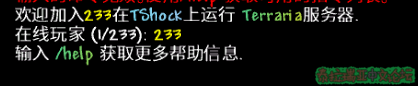
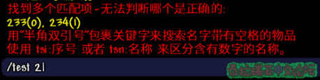

# Part 5.玩家对象​

本章你将学到：  

- 学习TSPlayer类的字段、方法等
- 学会Player类的常用字段、方法等

## 什么是TSPlayer类？

- TSPlayer是TShock的一个类，属于"TShock"的东西。这个类往往包含TShock服务器最常用的玩家数据和方法，其中的方法字段几乎全部对服务端都是有效的。  

## 什么是Player类？

- Player是Terraria的一个类，属于"Terraria"的东西。这个类包含Terraria常用的玩家数据，这个类里的字段、方法繁多且杂乱，而且还包含了许多客户端才有效的字段、方法，只有部分方法、字段服务端可用。  
---
## TSPlayer对象

### 获取TSPlayer对象  
获取玩家对象的方法有多种，主要根据你的需要选择，下面的代码通过不同的方式获取TSPlayer玩家对象  
- TSPlayer.FindByNameOrID\(\)方法 \(主要用于命令\)  
 >TSPlayer.FindByNameOrID\(\)会返回一个列表，包含所有匹配的玩家对象，当然没有匹配结果会返回一个空列表  


```csharp
private void Test(CommandArgs args)
{
    TSPlayer plr;
    List<TSPlayer> plrs = TSPlayer.FindByNameOrID(args.Parameters[0]);
    //args.Parameters[0]为玩家名字或索引
    //如果参数为 tsi:2 则表示索引为2的玩家
    //如果参数为 tsn:233 则表示名字为233的玩家
    if (plrs.Count == 0)
    {
        args.Player.SendErrorMessage("玩家不存在！"); //发送错误消息
        return;
    }
    else if (plrs.Count > 1)
    {
        args.Player.SendMultipleMatchError(plrs.Select(p => p.Name)); //发送多个匹配结果错误
        //会向玩家发送:
        //找到多个匹配项-无法判断哪个是正确的:
        //玩家1，玩家2....
        //用"半角双引号"包裹关键字来搜索名字带有空格的物品
        //使用 tsi:序号 或者 tsn:名称 来区分含有数字的名称.
        return;
    }
    else
    {
        plr = plrs[0];
        //找到匹配的玩家对象
    }
}
```

- Index索引获取  

```csharp
TSPlayer plr= TShock.Players[index]; //index为玩家索引
```

> 这种方法非常重要，常常用在ServerApi钩子获取TSPlayer对象 

```csharp
//插件加载时执行的代码
public override void Initialize()
{
    ServerApi.Hooks.ServerChat.Register(this, OnChat);
    Commands.ChatCommands.Add(new Command(Test, "test"));
}

private void OnChat(ServerChatEventArgs args)
{
    TSPlayer plr = TShock.Players[args.Who]; //获取钩子触发者的TSPlayer对象
}

//插件卸载时执行的代码
protected override void Dispose(bool disposing)
{
    if (disposing)
    {
        ServerApi.Hooks.ServerChat.Deregister(this, OnChat);
    }
    base.Dispose(disposing);
}
```

- 通过Where进行搜索  
> 这种方法用于寻找特定条件的玩家，是一种万能的方法，示例代码如下: 
 (p!=null 很重要，请务必写上)  


```csharp
string name = "233"; //假设的量
string acc = "233";
string ip = "127.0.0.1";

TSPlayer plr;
//var是推断类型的意思，使用var编译器会自己判断变量的类型，下面是一种偷懒的写法，完整的应该是IEnumerable<TSPlayer> plrs
var plrs= TShock.Players.Where(p => p!=null && p.Name == name); //通过玩家名字获取玩家对象
//var plrs = TShock.Players.Where(p => p != null && p.Account.Name == acc); //通过账号名字获取玩家对象
//var plrs = TShock.Players.Where(p => p != null && p.IP == ip); //通过IP获取玩家对象
//var plrs = TShock.Players.Where(p => p != null && p.Account.Name == acc && p.IP == ip ); //通过IP和账号名字获取玩家对象
//当然如果你需要的是单个玩家对象，你需要使用下列的代码进行判断
//如果你需要的符合条件的所有玩家，那么plrs就是结果
if (plrs.Count() == 0)
{
    //玩家对象不存在
    return;
}
else if (plrs.Count() > 1)
{
    //玩家对象存在多个
    return;
}
else
{
    plr = plrs.First();
    //plr即为玩家对象
}
```


### TSPlayer对象中常用字段和方法

- TSPlayer类中的常用属性\(加粗的要求记忆，其他的参考就好\)

| 名称 | 类型 | 作用/含义 |
| --- | --- | --- |
| **Name** | string | 玩家角色名 |
| **Index** | int | 玩家索引 |
| **Group** | Group | 玩家所处的组对象 |
| **Account** | UserAccount | 玩家的账号对象 |
| **TPlayer** | Player | 玩家的Player对象 |
| UUID | string | 玩家客户端的UUID |
| IP | string | 玩家IP地址 |
| **X** | float | 玩家的X坐标 |
| **Y** | float | 玩家的Y坐标 |
| **TileX** | int | 玩家所处图格的X坐标\(TileX=\[取整\]X/16\) |
| **TileY** | int | 玩家所处图格的Y坐标\(TileY=\[取整\]X/16\) |
| **Team** | int | 玩家队伍\(无队伍0，红队1，绿队2，蓝队3，黄队4，粉队5\) |
| **RealPlayer** | bool | 正常玩家\(true\);控制台或REST\(false\) \[主要用于在命令中区分玩家和控制台\] |
| RespawnTimer | int | 玩家重生计时器\(单位:秒\) |
| LoginAttempts | int | 玩家登录尝试次数 |
| **Active** | bool | 玩家的活动状态\(通常为true\) |
| ConnectionAlive | bool | 玩家的连接状态\(正常为true\) |
| DataWhenJoined | PlayerData | 玩家加入时的人物数据(即本地存档) |
| **Inventory** | IEnumerable\<Item> | 玩家背包(前5行) |
| **Accessories** | IEnumerable\<Item> | 玩家的配饰 |
| **InventorySlotAvailable** | bool | 玩家背包是否有多余 |
| **SelectedItem** | Item | 玩家当前手持的物品 |
| State | int | 玩家的客户端状态\(与加入服务器有关\) |
| LastThreat | DateTime | 玩家上次被冻结\(Disable\)的时间\(Utc\) |
| PaintThreshold | int | 玩家在上一秒漆墙的数量 |
| ProjectileThreshold | int | 玩家在上一秒生成弹幕的数量 |
| TileKillThreshold | int | 玩家在上一秒破坏图格的数量 |
| TileLiquidThreshold | int | 玩家在上一秒放置液体的数量 |
| TilePlaceThreshold | int | 玩家在上一秒放置图格的数量 |
| HealOtherThreshold | int | 玩家在上一秒治疗玩家的次数 |
| TilesCreated | Dictionary\<Vector2, ITile> | 玩家放置的待摧毁图格\(与图格回弹有关\) |
| TilesDestroyed | Dictionary\<Vector2, ITile> | 玩家摧毁的待放置图格\(与图格回弹有关\) |
| AwaitingName | bool | 等待玩家获取区域名字 |
| AwaitingNameParameter | string\[\] | 获取区域名字时，区域的控制字符\(-u 包含保护的区域，-z 包含区域Z索引，-p 玩家将持续接受区域编辑信息？\) |
| AwaitingTempPoint | int | 等待玩家设置区域临时点\(0未等待，1点1等待中，2点2等待中\) |

- TSPlayer类中的字段(加粗的要求记忆，其他的参考就好)

| 字段名 | 类型 | 作用/含义 |
| --- | --- | --- |
| AcceptingWhispers | bool | 玩家是否接受耳语(私聊) (/w) |
| **ActiveChest** | int | 玩家当前打开的箱子ID \(玩家没有开箱子则未-1\) |
| AwaitingResponse | Dictionary\<string, Action\<object>> | 玩家等待特定命令的响应的列表\(\?\) |
| Confused | bool | 玩家是否处于控制左右颠倒\(已失效\) |
| Country | string | 玩家的国家代码\(需要在Config开启EnableGeoIP\)\(无数据N/A, 代理A1\) |
| CurrentRegion | Region | 玩家当前所处的区域 |
| **Dead** | bool | 玩家是否处于死亡状态 |
| **Difficulty** | int | 玩家的角色难度\(软核0，中核1，硬核2，旅行3\) |
| DisplayLogs | bool | 是否向玩家发送服务器日志 |
| GodMode | bool | 玩家是否已启用上帝模式\(直接修改不影响玩家的无敌状态\) |
| HasBeenNaggedAboutLoggingIn | bool | 玩家是否已经被提示过修改区域需要登录 |
| IceTiles | List\<Point> | 玩家放置冰砖\(冰杖\)的点 |
| IsDisabledForBannedWearable | bool | 玩家是否由于携带禁用物品而被限制行动\(Disable\) |
| IsDisabledForSSC | bool | 玩家是否由于没有登录以获取SSC数据而被限制行动\(Disable\) |
| IsDisabledForStackDetection | bool | 玩家是否由于恶意修改物品堆叠而被限制行动\(Disable\) |
| IsDisabledPendingTrashRemoval | bool | 玩家是否由于在登录前在垃圾桶放置物品而被限制行动\(Disable\) |
| IsLoggedIn | bool | 玩家是否已经登录 |
| ItemInHand | Item | 玩家手持的物品 |
| LastKilledProjectile | int | 玩家上一次试图清除的最后一个弹幕 |
| LastNetPosition | Vector2 | 玩家最后更新时的图格坐标\(TileXY\) |
| lastPermissionWarning | long | 玩家上次被提示无权建筑警告的时间戳 |
| LastPvPTeamChange | DateTime | 玩家上次切换队伍或PVP状态的时间 |
| LastWhisper | TSPlayer | 玩家上次进行耳语\(私聊或被私聊\)的对象 |
| LoginHarassed | bool | 玩家是否因为登录而被限制行动\(\?\) |
| **LoginMS** | long | 玩家加入服务器时的时间戳 |
| mute | bool | 玩家是否处于禁言状态 |
| **PlayerData** | PlayerData | 玩家的SSC人物数据 |
| RecentFuse | int | 玩家使用炸药的倒计时，即距离下次可用正常使用炸弹剩余时间\(单位: 秒\) |
| RecentlyCreatedProjectiles | List\<GetDataHandlers.ProjectileStruct> | 跟踪这个玩家最近创建的弹幕OnSecondUpdate\(\) 在异步任务中删除这个。超过5秒的投射物将从这个集合中清除，因为它们不再是“最近的”。 |
| RequestedSection | bool | 玩家是否已请求过获取地图区块 |
| RequiresPassword | bool | 玩家是否被要求输入密码\(加入服务器前\) |
| RPPending | int | 玩家传送到上次离开服务器位置的倒计时\(单位: 秒\) |
| SilentJoinInProgress | bool | 玩家是否静默加入服务器\(不发送玩家加入服务器的提示\) |
| SilentKickInProgress | bool | 玩家是否静默踢出服务器\(不发送玩家踢出服务器的提示\) |
| sX | int | 玩家出生点的X坐标(修改无效) |
| sY | int | 玩家出生点的Y坐标(修改无效) |
| TeleportCoords | Vector2 | 不明，在TShock已弃用 |
| tempGroup | Group | 玩家当前的临时组\(会覆盖原来的组\) |
| tempGroupTimer | Timer | 玩家临时组有效期的计时器 |
| **TempPoints** | Point\[2\] | 玩家设置的区域临时点 |
| TPAllow | bool | 玩家是否允许其他玩家对他使用TP类命令\(tshock.tp.override忽略此限制\) |

- TSPlayer类中的方法(几乎全要记住)

| 方法名 | 参数 | 返回值 | 作用 |
| --- | --- | --- | --- |
| Ban | string reason\(封禁理由\), string adminUserName = null\(管理用户名\) | bool\(封禁是否成功\) | 封禁玩家\(通常使用TShock.Bans.InsertBan和Kick组合封禁玩家\) |
| DamagePlayer | int damage\(造成伤害点数\) | void | 对玩家造成伤害\(会造成击退\)\[如果你只是想扣除玩家血量，请直接修改他的生命值\] |
| Disable | string reason = ""\(理由\), DisableFlags flags = DisableFlags.WriteToLog\(日志记录模式\) | void | 限制玩家行动\(石化玩家\) |
| Disconnect | string reason\(理由\) | void | 断开玩家连接 |
| GiveItem | int type\(物品ID\), int stack\(物品堆叠\), int prefix = 0\(物品修饰语ID\) | void | 给予玩家物品 |
| GiveItemCheck | int type\(物品ID\), string name\(物品全名\[用于检测是否属于封禁物品\]\), int stack\(物品堆叠\), int prefix = 0\(物品修饰语ID\) | bool\(检查结果\) | 判断玩家是否能被给予某物品 |
| HasBuildPermission | int x\(TileX\), int y\(TileY\), bool shouldWarnPlayer = true\(是否警告玩家\) | bool\(检查结果\) | 判断玩家是否能编辑此图格 |
| HasBuildPermissionForTileObject | int x\(TileX\), int y\(TileY\), int width\(宽度\), int height\(高度\), bool shouldWarnPlayer = true\(是否警告玩家\) | bool\(检查结果\) | 判断玩家是否能编辑以\(X,Y\)为左下角，宽度为width，高度为height的矩形\(只要范围内有一个图格玩家不能编辑就会返回false\) |
| HasHackedItemStacks | bool shouldWarnPlayer = false\(是否警告玩家\) | bool\(检查结果\) | 检测玩家是否作弊堆叠\(例如：堆叠999999土块\) |
| HasModifiedIceSuccessfully | int x\(TileX\), int y\(TileY\), short tileType\(图格类型\), GetDataHandlers.EditAction editAction\(编辑操作类型\) | bool\(检查结果\) | 判断玩家是否成功编辑冰\(冰杖生成的\) |
| HasPaintPermission | int x\(TileX\), int y\(TileY\) | bool\(检查结果\) | 判断玩家是否能为此图格涂漆 |
| HasPermission | string permission\(权限\) | bool\(检查结果\) | 判断玩家是否拥有某个权限  \(优先级如下:  1.权限钩子修改的结果  2.临时组的权限  3.玩家当前组的权限\)  \[临时组和玩家组的权限不叠加\] |
| Heal | int health = 600\(治疗点数\) | void | 治疗一个玩家 |
| IsBeingDisabled | 无 | bool\(检查结果\) | 判断玩家是否被限制行动 |
| IsBouncerThrottled | 无 | bool\(检查结果\) | 判断玩家是否被Bouncer限制\(\?\) |
| IsInRange | int x\(TileX\), int y\(TileY\), int range = 32\(检查半径\) | bool\(检查结果\) | 判断玩家是否在以\(X,Y\)为圆点range为半径的圆内\[当Config的RangeChecks被设为false后无论结果只返回true\] |
| Kick | string reason\(理由\), bool force = false\(强制踢出\[无视tshock.admin.nokick权限\]\), bool silent = false\(不发送广播\), string adminUserName = null\(管理员名\), bool saveSSI = false\(保存玩家SSC数据\) | bool\(踢出结果\) | 踢出一名玩家 |
| KillPlayer | 无 | void | 杀死玩家\(对上帝模式玩家无效\)\[原理是对玩家造成99999点伤害=DamagePlayer\(99999\)\] |
| Logout | 无 | void | 使玩家登出 |
| RemoveProjectile | int index\(弹幕ID\), int owner\(弹幕发射者索引\) | void | 移除一个弹幕\(\?\) |
| SaveServerCharacter | 无 | bool\(保存结果\) | 保存玩家的SSC云存档\(服务器没有打开SSC时总返回false\) |
| SetBuff | int type\(增益ID\), int time = 3600\(持续帧\[1秒=60帧\]\), bool bypass = false\(忽略Bouncer对玩家的限制\) | void | 添加玩家BUFF\(若玩家已有该BUFF且持续时间更长，你添加的BUFF会被忽略\)\[BUFF时间不会叠加\] |
| SetPvP | bool mode\(true打开，false关闭\), bool withMsg = false\(是否广播PVP打开提示\) | void | 切换玩家PVP状态 |
| SetTeam | int team\(无队伍0，红队1，绿队2，蓝队3，黄队4，粉队5\) | void | 切换玩家队伍\(不发送广播\) |
| Spawn | PlayerSpawnContext context\(玩家生成的原因\), int\? respawnTimer = null\(重生倒计时\[似乎无效\]\) | void | 复活一个玩家 |
| Spawn | int tilex, int tiley, PlayerSpawnContext context, int\? respawnTimer = null, short\? numberOfDeathsPVE = null, short\? numberOfDeathsPVP = null | void | 复活玩家，大部分参数无效，不做解释 |
| Teleport | float x\(X坐标\), float y\(Y坐标\), byte style = 1\(TP类型\[不做解释\]\) | void | 将玩家传送到某一位置 |
| Whoopie | object time\(其实是个int，单位:秒\) | void | 发出烦人的声音 需要另开线程使用，否则会卡死主线程 |
| TempGroupTimerElapsed | 不做解释 | 不做解释 | 不应该被Pubic的内部方法 |

_\*部分方法例如:SendDate另做介绍_


- 发送消息  

| 字段名 | 参数 | 返回值 | 作用/含义 |
| --- | --- | --- | --- |
| SendMessage | string msg(内容), Color color | void | 发送自定义颜色消息 |
| SendMessage/SendMessageFromPlayer | string msg(内容), byte red, byte green, byte blue(十进制颜色代码) | void | 发送自定义颜色消息 |
| SendInfoMessage | string msg(内容), params object\[\] args | void | 发送黄色提示消息 |
| SendSuccessMessage | string msg(内容), params object\[\] args | void | 发送绿色成功消息 |
| SendWarningMessage | string msg(内容), params object\[\] args | void | 发送橙色警告消息 |
| SendErrorMessage | string msg(内容), params object\[\] args | void | 发送红色错误消息 |
| SendFileTextAsMessage | string file(文件路径) | void | 将文本文件内容发送给玩家  (支持替换:  %map%:地图名  %players%:在线玩家  %specifier%:命令标识符  %onlineplayers%:在线玩家数  %serverslots%:最大玩家数) |
| SendMultipleMatchError | IEnumerable\<object> matches(不好解释) | void | 发送多个匹配错误信息 |

效果:  
 -  SendMessage/SendInfoMessage/SendSuccessMessage/SendWarningMessage/SendErrorMessage  


```csharp
args.Player.SendMessage("我是SendMessage~", 255, 155, 15);
args.Player.SendInfoMessage("我是SendInfoMessage~,你的Index是{0}",args.Player.Index);
args.Player.SendSuccessMessage("我是SendSuccessMessage~,你现在在{0}地图游玩，所在路径是{1}",Main.worldName,Main.worldPathName);
args.Player.SendWarningMessage("我是SendWarningMessage~");
args.Player.SendErrorMessage("我是SendErrorMessage~");
```


  
- SendFileTextAsMessage  

```csharp
args.Player.SendFileTextAsMessage("tshock/motd.txt"); //相对路径
//args.Player.SendFileTextAsMessage("C:/Users/13110/Desktop/code/TShock144/tshock/motd.txt"); //绝对路径
```

```
#motd.txt
欢迎加入[c/ffff00:%map%]在[c/7ddff8:T][c/81dbf6:S][c/86d7f4:h][c/8ad3f3:o][c/8ecef1:c][c/93caef:k]上运行 [c/55d284:T][c/62d27a:e][c/6fd16f:r][c/7cd165:r][c/89d15a:a][c/95d150:r][c/a4d145:i][c/b1d03b:a]服务器.
[c/FFFFFF:在线玩家 (%onlineplayers%/%serverslots%):] [c/FFFF00:%players%]
输入 [c/55D284:%specifier%][c/62D27A:h][c/6FD16F:e][c/7CD165:l][c/89D15A:p] 获取更多帮助信息.
```



  
  
-  SendMultipleMatchError  
```csharp
TSPlayer plr;
List<TSPlayer> plrs = TSPlayer.FindByNameOrID(args.Parameters[0]);
//args.Parameters[0]为玩家名字或索引
//如果参数为 tsi:2 则表示索引为2的玩家
//如果参数为 tsn:233 则表示名字为233的玩家
if (plrs.Count == 0)
{
    args.Player.SendErrorMessage("玩家不存在！"); //发送错误消息
    return;
}
else if (plrs.Count > 1)
{
    args.Player.SendMultipleMatchError(plrs.Select(p => $"{p.Name}({p.Index})")); //发送多个匹配结果错误
                                                                  //会向玩家发送:
                                                                  //找到多个匹配项-无法判断哪个是正确的:
                                                                  //玩家1(0)，玩家2(1)....
                                                                  //用"半角双引号"包裹关键字来搜索名字带有空格的物品
                                                                  //使用 tsi:序号 或者 tsn:名称 来区分含有数字的名称.
    return;
}
else
{
    plr = plrs[0];
    args.Player.SendSuccessMessage("找到匹配项！");
    //找到匹配的玩家对象
}
```




---
## Player对象

### 获取Player对象

- 通过TSPlayer获取(推荐)
```csharp
TSPlayer plr;
...(通过上面的方法找到TSPlayer对象)
Player tplr = plr.TPlayer;
```

- 直接**通过索引**  

```csharp
Player tplr = Main.player[index];
```

- 通过Where进行搜索(其实建议先找TSPlayer的...)  
    > 这种方法用于寻找特定条件的玩家，是一种万能的方法，示例代码如下: (p!=null 很重要，请务必写上)
```csharp
string name = "233"; //假设的量
Player tplr;

//var是推断类型的意思，使用var编译器会自己判断变量的类型，下面是一种偷懒的写法，完整的应该是IEnumerable<Player> plrs
var tplrs = Main.player.Where(p => p != null && p.name == name); //通过玩家名字获取玩家对象
if (tplrs.Count() == 0)
{
    //玩家对象不存在
    return;
}
else if (tplrs.Count() > 1)
{
    //玩家对象存在多个
    return;
}
else
{
    tplr = tplrs.First();
    //plr即为玩家对象
}
```
  
### Player对象常用方法和字段
- 生命/魔力

| 字段名 | 类型 | 作用/意义 |
| --- | --- | --- |
| statLife | int | 玩家当前生命值 |
| statLifeMax | int | 玩家生命上限(不包括生命力药水、饰品等额外增加的生命) |
| statLifeMax2 | int | 玩家生命上限(包括生命力药水、饰品等额外增加的生命)\[不可修改\] |
| statMana | int | 玩家当前魔力值 |
| statManaMax | int | 玩家魔力上限(不包括水晶球、饰品等额外增加的魔力) |
| statManaMax2 | int | 玩家魔力上限(包括水晶球、饰品等额外增加的魔力)\[不可修改\] |

- 永久增益

| 字段名 | 类型 | 作用/意义 |
| --- | --- | --- |
| extraAccessory | bool | 恶魔之心(增加饰品格位) |
| unlockedBiomeTorches | bool | 火把神徽章(环境火把) |
| ateArtisanBread | bool | 工匠面包(扩大制作站范围) |
| usedAegisCrystal | bool | 生命水晶(永久强化生命再生) |
| usedAegisFruit | bool | 埃癸斯果(永久提高防御力) |
| usedArcaneCrystal | bool | 奥术水晶(永久提高魔力再生) |
| usedGalaxyPearl | bool | 银河珍珠(永久增加运气) |
| usedGummyWorm | bool | 黏性蠕虫(永久提高钓鱼技能) |
| usedAmbrosia | bool | 珍馐(永久提高采矿和建造速度) |
| unlockedSuperCart | bool | 矿车升级包 |

- 背包库存相关

| 字段名 | 类型 (长度) | 作用/意义 |
| --- | --- | --- |
| inventory | Item\[\] (59) | 背包(0-49:背包 ; 50-53:钱币 ; 54-58:弹药) |
| trashItem | Item | 垃圾桶物品 |
| bank | Chest (item:40) | 猪猪储钱罐(bank.item) |
| bank2 | Chest (item:40) | 保险箱(bank2.item) |
| bank3 | Chest (item:40) | 护卫熔炉(bank3.item) |
| bank4 | Chest (item:40) | 虚空保险箱(bank4.item) |
| armor | Item\[\] (20) | 装备栏  (0:头盔 ; 1:上衣 ; 2裤子 ; 3-9: 配饰)  (10:时装头盔 ; 11:时装上衣 ; 12时装裤子 ; 13-19: 时装配饰) |
| dye | Item\[\] (10) | 染料 |
| CurrentLoadoutIndex | int | 当前玩家装备栏索引 |
| Loadouts | EquipmentLoadout(3)  (Armor:20;Dye:10) | 玩家装备栏,eg:  ```Item[] armor = tplr.Loadouts[1].Armor;``` |

- 群系&环境相关
  

| 字段名 | 类型 | 环境/区域/群系 |
| --- | --- | --- |
| ZoneSkyHeight | bool | 太空 |
| ZoneOverworldHeight | bool | 地表 |
| ZoneDirtLayerHeight | bool | 地下 |
| ZoneRockLayerHeight | bool | 洞穴 |
| ZoneUnderworldHeight | bool | 地狱 |
| ZoneCorrupt | bool | 腐化之地 |
| ZoneCrimson | bool | 猩红之地 |
| ZoneHallow | bool | 神圣之地 |
| ZoneDesert | bool | 沙漠 |
| ZoneUndergroundDesert | bool | 地下沙漠 |
| ZoneJungle | bool | 丛林(雨林) |
| ZoneLihzhardTemple | bool | 丛林神庙 |
| ZoneBeach | bool | 沙滩 |
| ZoneMarble | bool | 大理石洞 |
| ZoneShimmer | bool | 微光 |
| ZoneGraveyard | bool | 墓地 |
| ZoneDungeon | bool | 地牢 |
| ZoneMeteor | bool | 陨石群系 |
| ZoneGlowshroom | bool | 发光蘑菇地 |
| ZoneGranite | bool | 花岗岩洞 |
| ZoneGemCave | bool | 宝石洞 |
| ZoneHive | bool | 蜂巢 |
| ZoneShadowCandle | bool | 暗影蜡烛 |
| ZonePeaceCandle | bool | 和平蜡烛 |
| ZoneWaterCandle | bool | 水蜡烛 |
| ZoneRain | bool | 下雨 |
| ZoneSnow | bool | 雪地 |
| ZoneSandstorm | bool | 沙尘暴 |
| ZoneOldOneArmy | bool | 撒旦军队 |
| ZoneTowerNebula | bool | 星云柱 |
| ZoneTowerSolar | bool | 日耀柱 |
| ZoneTowerStardust | bool | 星尘柱 |
| ZoneTowerVortex | bool | 星旋柱 |

- 其他

| 字段名 | 类型 | 作用/意义 |
| --- | --- | --- |
| ghost | bool | 玩家幽灵状态 |
| luck | float | 玩家幸运值 |
| anglerQuestsFinished | int | 玩家已完成渔夫任务数 |
| golferScoreAccumulated | int | 玩家已经获得的高尔夫球分数 |
| difficulty | byte | 玩家角色难度(软核0，中核1，硬核2，旅行3) |
| SelectedItem | int | 玩家当前手持物品的slot(背包索引) |