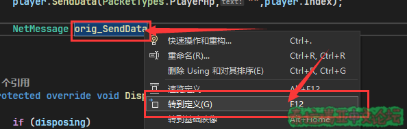
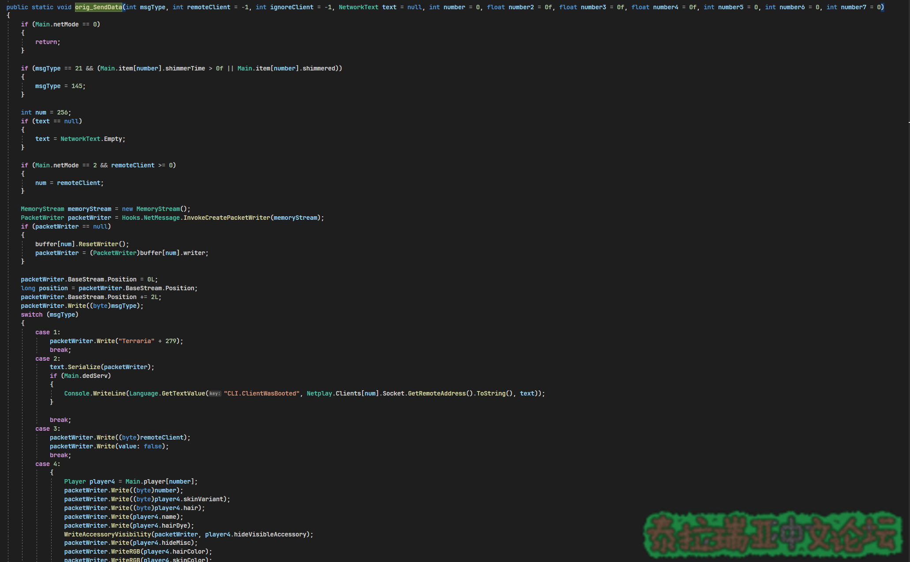
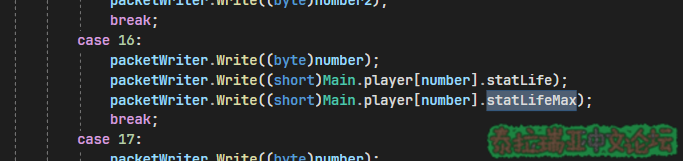
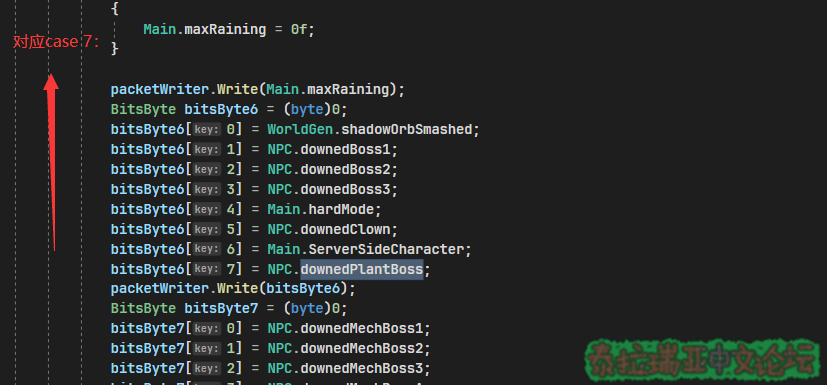
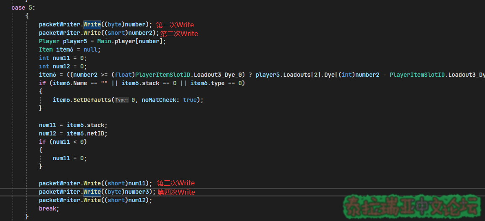
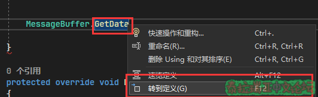
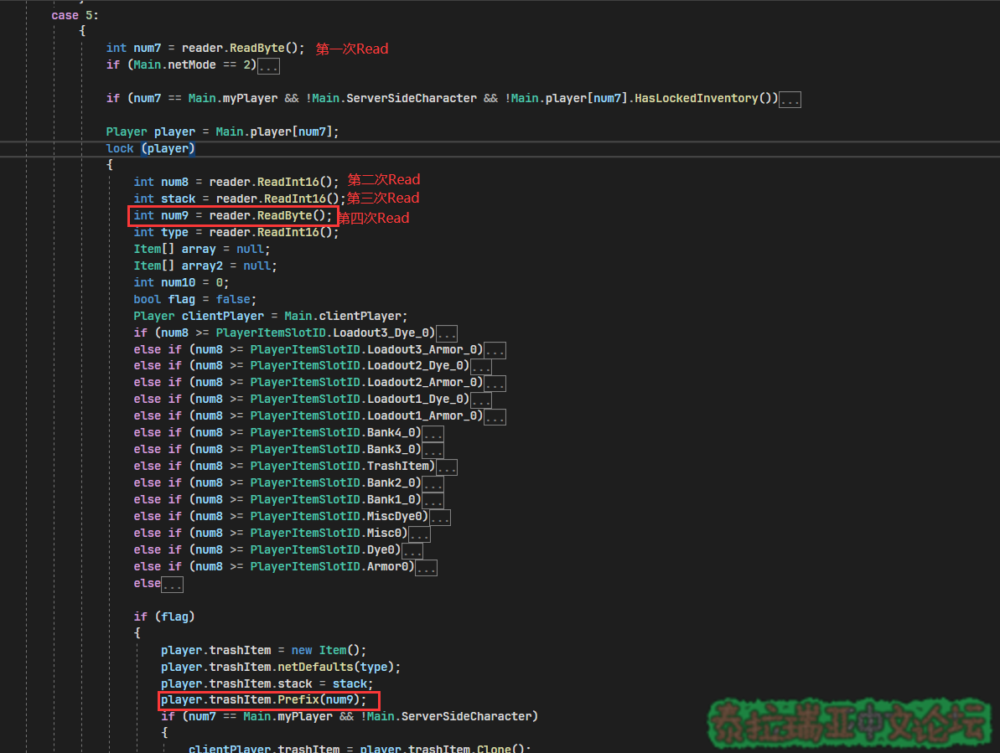

## Part 6.发送数据包​

本章你将学到：  

- 如何向玩家发送数据包
- 研究不同数据包参数的方法

### 什么是数据包？​

### 顾名思义，数据包就是存放数据的包。这些包会告诉玩家的客户端一些游戏内的信息\(例如物品掉落、地图时间等\)，当然服务器也可以接受来自玩家的数据包​

### 为什么要发送数据包？​

当你直接修改Terraria服务端中的属性、变量等\(例如：玩家最大血量、下雨等\)，你会发现你的修改没办法马上生效，这时候就需要向玩家发送一个数据包用来告诉客户端你修改的信息  

### 如何发送数据包？​

我们可以调用TSPlayer对象中的SendData方法来发送数据包  
首先我们需要获取对应的TSPlayer对象，前面教程已经有了，就不在过多赘述  
注: 如果你需要发送全服数据包玩家对象就是TSPlayer.All  
然后我们就要使用SendData方法  

C#：

```csharp
player.SendData(数据包类型,字符串参数,参数1,参数2...);
```

以修改玩家最大生命值为例：  

C#：

```csharp
private void TestCmd(CommandArgs args) //以命令为例
{
    var player = args.Player;  //获取玩家的对象
    player.TPlayer.statLifeMax = 11451;  //修改玩家最大生命值(注意: statLifeMax2是加上药水饰品等的最大生命值)
    player.SendData(PacketTypes.PlayerHp,"",player.Index);  //向玩家发送数据包更新
}
```

此时你应该会想问:  
WTF\?  
为什么数据包类型是PlayerHp，为什么参数1是玩家的索引\(player.Index\)，为什么SendData的参数里没有我要改的血量11451\?  

### 发送数据包\(SendData\)的参数:​

这里有一个~~奇怪的误区~~，SendData的参数并不一定是写进数据包的值\(上面例子中:参数1是player.Index而不是TPlayer.statLifeMax\)，对于不同的数据包SendData的参数也会有所不同。想要知道具体参数作用，我们需要反编译NetMessage.orig\_SendData，方法就是直接在可以执行语句的地方打一个NetMessage.orig\_SendData，然后右键orig\_SendData，点击转到定义,等待一下反编译我们就能看到NetMessage.orig\_SendData的代码了  



  
往下翻，我们会发现有一个switch-case结构, 其中case中的数字就是数据包的编号  



  
以修改玩家最大生命为例\(修改了玩家的statLifeMax\) 我们直接按Ctrl+F搜索statLifeMax  
此时搜索到16号数据包的case，所以我们需要发送的就是16号数据包\(PacketTypes.PlayerHp\)  

> 注: 你可以用类似的方法查看PacketTypes的定义来找到数据包类型\(16=>PacketTypes.PlayerHp\)


如果你嫌麻烦也可以直接使用"\(PacketTypes\)数据包号"  
\[例如: \(PacketTypes\)16\]  
我们仔细查看这个case部分不难看出, number\(参数1\)，就是玩家的索引\(number为0时发送索引为0的玩家的生命数据，number为1时发送索引为1的玩家的生命数据...\) \[number2对应参数2，number3对应参数3，有些数据包需要用到字符串参数\(例如: 弹幕文字、断开连接等\)\]  



  
得出:  

C#：

```csharp
player.SendData(PacketTypes.PlayerHp,"",玩家索引);
```


### 再分析一个数据包试试​

假设我们现在想把服务器中的世纪之花设置为已击败状态\(NPC.downedPlantBoss=true\),我们现在需要告诉所有的玩家世纪之花已被击败而不是执行命令的人，所以我们需要使用TSPlayer.All作为对象  

C#：

```csharp
private void TestCmd(CommandArgs args) //测试命令 (这里只是方便演示)
{
    NPC.downedPlantBoss = true; //设置世纪之花为已击败状态
    TSPlayer.All.SendData(数据包，"", 参数1, 参数2..); //向所有玩家发送数据包
}
```

然后我们转到NetMessage.orig\_SendData\(\)搜索downedPlantBoss，找到对应的位置后，详细的阅读这个case中的代码找number，  
发现这个case中没有使用任何number或者text \(不需要任何参数和文本\)  



  
所以我们直接调用下面的方法就可以发送数据包了 \(由于7号数据包没有使用任何参数和文本，所以我们直接只填入包类型就好\)  

C#：

```csharp
private void TestCmd(CommandArgs args)
{
    NPC.downedPlantBoss = true; //设置世纪之花为已击败状态
    TSPlayer.All.SendData(PacketTypes.WorldInfo);
//通过查看PacketTypes的定义可以找到数据包编号(7)对应的和PacketTypes(PacketTypes.WorldInfo)
    //也可以直接使用TSPlayer.All.SendData((PacketTypes)7); 但是PacketTypes.WorldInfo的代码可读性更高
}
```

奇怪的东西  
有一个编写插件常常用到的数据包PlayerSlot\(5号\)，这个数据包的作用是修改玩家背包的物品\(包括装备栏的物品\)  
我们转到NetMessage.orig\_SendData\(\) 找到5号的对应代码  



  
从上面的代码我们能发现number\(参数1\)是玩家的索引\(Index\), number2\(参数2\)是对应格子的索引，而number3\(参数3\)却很难看出他的作用，此时我们可以通过查看MessageBuffer.GetData的定义来找到number3的作用  



  
根据NetMessage.orig\_SendData\(\)中代码number3在第4次被Write进数据包, 那么number3在MessageBuffer.GetData中也会在第4次被Read进变量中，所以MessageBuffer.GetData中的num9就是NetMessage.orig\_SendData\(\)中的number3\(参数3\)，然后我们发现，在使用Prefix方法的时候使用了num9\(也就是number3\)，从wiki上我们可以知道prefix是修饰语的意思，所以number3就是修饰语ID  



  
得出:  

C#：

```csharp
player.SendData(PacketTypes.PlayerSlot,"",玩家索引,背包格子索引,物品修饰语ID);
```


