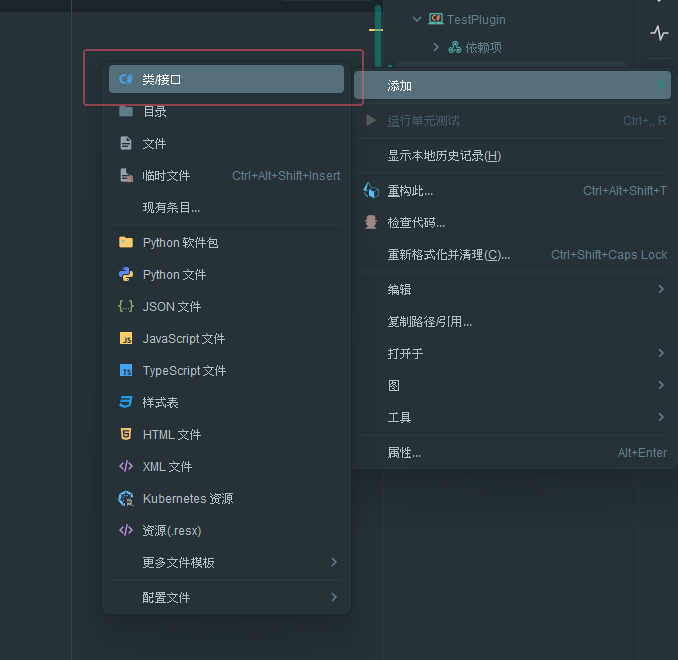
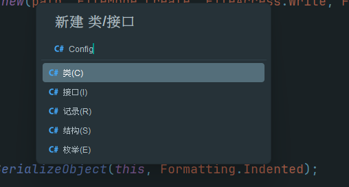
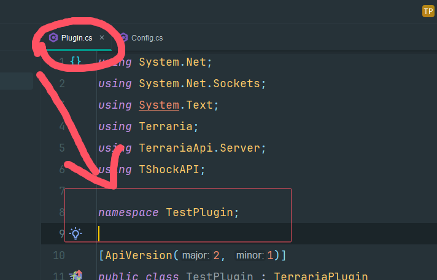

# Part 7.插件配置文件 (临时加更)

本章你将学到：  

- 如何优雅的`创造`、`读取`、`写入`配置文件


## 啥是配置文件?
- 配置文件用于存放插件的相关设置，TShock插件的配置文件格式一般为`json`(可带注释)。
- 配置文件一般直接面向服主，可读性要求高
- 配置文件在插件中一般初始化时读取一次，`/reload`的时候读取一次

## `Newtonsoft.Json`

- `Newtonsoft.Json`是`TShock`所使用的`json`库，拥有十分强大的功能.使用`Newtonsoft.Json`的工具操作`json`需要使用`using`语句导入
```csharp
using Newtonsoft.Json;
```

## 定义配置文件

1. 首先我们要创造一个新的`.cs`文件用来存放我们的配置文件类。我们可以右键`解决方案管理器-添加-类/接口`，文件名一般和类名一样，通常使用`Conifg`



2.首先我们可以套一个模板
```csharp
using Newtonsoft.Json;

namespace TestPlugin; //这里要改成和你插件命名空间一样

public class Config
{
    /// <summary>
    /// 配置文件路径
    /// </summary>
    private const string ConfigPath = "tshock/TestPlugin.json"; 
    
    /// <summary>
    /// 配置文件实例
    /// </summary>
    public static Config Instance = new();  

    private static readonly JsonSerializerSettings JsonSettings = new() //配置文件格式化相关，不熟悉Newtonsoft.Json不要更改
    {
        Formatting = Formatting.Indented,
        ObjectCreationHandling = ObjectCreationHandling.Replace
    };
    
    /*
     *从这开始，就算是正式的配置项部分, 这里以 `在服务器发送表情踢出玩家为例`
     */
    
    /// <summary>
    /// 允许玩家发表情
    /// </summary>
    [JsonProperty]
    public bool AllowSendEmoji; 
    
    /// <summary>
    /// 玩家发表情后踢出的消息
    /// </summary>
    [JsonProperty]
    public string SendEmojiKickMessage = "此服务器不允许发表情!!!";
    
    
    
    /// <summary>
    /// 将配置文件写入硬盘
    /// </summary>
    public void Write() 
    {
        using FileStream fileStream = new(ConfigPath, FileMode.Create, FileAccess.Write, FileShare.Write);
        using StreamWriter streamWriter = new(fileStream);
        streamWriter.Write(JsonConvert.SerializeObject(this, JsonSettings));
    }

    /// <summary>
    /// 从硬盘读取配置文件
    /// </summary>
    public void Read() 
    {
        Config result;
        if (!File.Exists(ConfigPath))
        {
            result = new Config();
            result.Write();
        }
        else
        {
            using FileStream fileStream = new(ConfigPath, FileMode.Open, FileAccess.Read, FileShare.Read);
            using StreamReader streamReader = new(fileStream);
            result = JsonConvert.DeserializeObject<Config>(streamReader.ReadToEnd(), JsonSettings)!;
        }
        Instance = result;
    }
}
```
 ### 注意:    
 #### 命名空间: 
```csharp
namespace TestPlugin;
```
`TestPlugin`就是你插件的命名空间如图 


#### 配置文件路径问题: 
```csharp
private const string ConfigPath = "tshock/TestPlugin.json"; 
```
`"tshock/TestPlugin.json"`是你配置文件的路径,这里不能套文件夹，要套文件夹可以使用`TryCreatingDirectory`
```csharp
private const string ConfigPath = "tshock/TestPlugin/TestPlugin.json"; //套文件夹的配置文件 

public void Read() 
{
    Config result;
    if (!File.Exists(ConfigPath))
    {
        Terraria.Utils.TryCreatingDirectory("tshock/TestPlugin"); //创建文件夹，返回值是bool(文件夹是否可用)
        result = new Config();
        result.Write();
    }
    else
    {
        using FileStream fileStream = new(ConfigPath, FileMode.Open, FileAccess.Read, FileShare.Read);
        using StreamReader streamReader = new(fileStream);
        result = JsonConvert.DeserializeObject<Config>(streamReader.ReadToEnd(), JsonSettings)!;
    }
    Instance = result;
}
```

#### 关于JsonProperty
- `[JsonProperty]`是`Newtonsoft.Json`的一个`特性(Attribute)`,这个东西是挂在字段头上或者前面，用来标记字段的。
`[JsonProperty]`可用来标记需要被写入配置文件的字段,当然默认情况下如果你使用`public`字段,即使不使用`[JsonProperty]`,也会写入配置中,但是`private`字段不会。  
 - 当然还有个特性叫`[JsonIgnore]`，有这个特性的字段不会被写进配置文件

## 初始化&使用配置文件
让我们回到插件主体，我们可用在`Initialize()`方法中加载我们的配置文件
```csharp
public override void Initialize()
{
    Config.Instance.Read(); //读取配置文件
}
```
初始化后，`tshock`文件夹下就会出现我们的配置文件啦! `(tshock\TestPlugin.json)`
```json 
{
  "AllowSendEmoji": false,
  "SendEmojiKickMessage": "此服务器不允许发表情!!!"
}
```

在使用配置项时可用直接从`Instance`中获取...
```csharp
if (!Config.Instance.AllowSendEmoji)
{
    TSPlayer.All.Kick(Config.Instance.SendEmojiKickMessage);
}
```
如果插件修改了某些配置，需要保存可用使用`Write()`方法
```csharp
Config.Instance.SendEmojiKickMessage = "5555,服主大人不让你发表情捏~"; //修改配置
Config.Instance.Write(); //写入配置文件
```
## 使用/reload重载配置文件
TShock提供了一个`Reload事件`，当运行`/reload`命令时会触发，我们可以在`Initialize()`方法中注册它
```csharp
public override void Initialize()
{
    Config.Instance.Read(); //读取配置文件
    GeneralHooks.ReloadEvent += OnReloadEvent; //注册Reload事件
}
protected override void Dispose(bool disposing)
{
    if (disposing)
    {
        GeneralHooks.ReloadEvent -=OnReloadEvent; //卸载Reload事件
    }
    base.Dispose(disposing);
}
private void OnReloadEvent(ReloadEventArgs e)
{
    Config.Instance.Read(); //读取配置文件
    e.Player.SendSuccessMessage("[TestPlugin]插件配置已重载喵~"); //向玩家发送提示~
}
```

## `[JsonProperty]`的进阶用法

### 自定义字段名
让我们回到`Conifg.cs`,有时候我们在代码里不想使用中文字段，但是我想要在配置文件中，让一些配置项是中文的要咋做呢?此时我们就可以使用`JsonProperty`的参数了，没错这玩意是有参数的 : (
```csharp
[JsonProperty("允许玩家发表情")]
public bool AllowSendEmoji; 

[JsonProperty("发表情踢出消息")]
public string SendEmojiKickMessage = "此服务器不允许发表情!!!";
```
此时初始化的配置文件
```json
{
  "允许玩家发表情": false,
  "玩家发表情后踢出的消息": "此服务器不允许发表情!!!"
}
```
### Order排序
有时候格式化代码的时候，IDEA会按照字母顺序排列这些字段，这样可能会导致配置中的字段乱掉。此时我们可以使用`JsonProperty`的`Order`参数来解决这个问题
```csharp
[JsonProperty("玩家发表情后踢出的消息",Order = 2)] //Oder 2更大排在后面
public string SendEmojiKickMessage = "此服务器不允许发表情!!!";

[JsonProperty("允许玩家发表情",Order = 1)] //Oder 1更小排在前面
public bool AllowSendEmoji; 
```
此时初始化的配置文件的配置项是按照我们给定`Order`排列的
```json
{
  "允许玩家发表情": false,
  "玩家发表情后踢出的消息": "此服务器不允许发表情!!!"
}
```
## 课后习题
写一个插件: 踢出在服务器发指定表情的玩家 ，要求可以配置表情的`ID`(多个)、`是否踢出`和`踢出消息`


<details>
<summary>参考答案</summary>

### `Plugin.cs`
```csharp
using Terraria;
using TerrariaApi.Server;
using TShockAPI;
using TShockAPI.Hooks;

namespace KickEmoji;

[ApiVersion(2, 1)]
public class KickEmoji : TerrariaPlugin
{
    public KickEmoji(Main game) : base(game)
    {
    }

    public override string Author => "Cai";
    public override string Description => "踢出哪些乱发表情的坏蛋~";
    public override string Name => "KickEmoji";
    public override Version Version => new(2024, 12, 21, 0); //版本号可以用日期哦~~~

    public override void Initialize()
    {
        Config.Instance.Read(); //读取配置文件
        GeneralHooks.ReloadEvent += OnReloadEvent; //注册Reload事件
        GetDataHandlers.Emoji.Register(OnPlayerSendEmoji); //注册发表情事件
    }
    
    protected override void Dispose(bool disposing)
    {
        if (disposing)
        {
            GeneralHooks.ReloadEvent -=OnReloadEvent; //卸载Reload事件
            GetDataHandlers.Emoji.UnRegister(OnPlayerSendEmoji); //卸载发表情事件
        }
        base.Dispose(disposing);
    }
    
    private void OnPlayerSendEmoji(object? sender, GetDataHandlers.EmojiEventArgs e)
    {
        if (Config.Instance.DisallowEmoji.Contains(e.EmojiID)) //判断是否为`禁用表情`
        {
            e.Handled = true; //处理掉这个`表情`
            
            if (Config.Instance.KickPlayer) //判断是否需要踢出玩家
            {
                e.Player.Kick(Config.Instance.SendEmojiKickMessage, true); //踢出玩家,Kick的第二个形参`force`是`强制踢出`,可踢管理员
            }
            else
            {
                e.Player.SendWarningMessage(Config.Instance.SendEmojiKickMessage); //警告玩家
            }
        }
        
    }
    private void OnReloadEvent(ReloadEventArgs e)
    {
        Config.Instance.Read(); //读取配置文件
        e.Player.SendSuccessMessage("[TestPlugin]插件配置已重载喵~"); //向玩家发送提示~
    }
    
}
```
`### Conifg.cs`
```csharp
using Newtonsoft.Json;

namespace KickEmoji;

public class Config
{
    /// <summary>
    /// 配置文件路径
    /// </summary>
    private const string ConfigPath = "tshock/KickEmoji.json"; 
    
    /// <summary>
    /// 配置文件实例
    /// </summary>
    public static Config Instance = new();  

    private static readonly JsonSerializerSettings JsonSettings = new() //配置文件格式化相关，不熟悉Newtonsoft.Json不要更改
    {
        Formatting = Formatting.Indented,
        ObjectCreationHandling = ObjectCreationHandling.Replace
    };
    
    /*
     *从这开始，就算是正式的配置项部分, 这里以 `在服务器发送表情踢出玩家为例`
     */
    
    /// <summary>
    /// 不允许玩家发的表情
    /// </summary>
    [JsonProperty("禁用表情ID",Order = 1)]
    public int[] DisallowEmoji = { 0,2 }; //爱心,哭泣

    /// <summary>
    /// 踢出发表情的玩家
    /// </summary>
    [JsonProperty("踢出玩家", Order = 2)] 
    public bool KickPlayer = true;
    
    /// <summary>
    /// 玩家发表情后的警告消息
    /// </summary>
    [JsonProperty("警告消息",Order = 3)]
    public string SendEmojiKickMessage = "555,服主不想让你发这个表情捏~";
    
    
    /// <summary>
    /// 将配置文件写入硬盘
    /// </summary>
    public void Write() 
    {
        using FileStream fileStream = new(ConfigPath, FileMode.Create, FileAccess.Write, FileShare.Write);
        using StreamWriter streamWriter = new(fileStream);
        streamWriter.Write(JsonConvert.SerializeObject(this, JsonSettings));
    }

    /// <summary>
    /// 从硬盘读取配置文件
    /// </summary>
    public void Read() 
    {
        Config result;
        if (!File.Exists(ConfigPath))
        {
            result = new Config();
            result.Write();

        }
        else
        {
            using FileStream fileStream = new(ConfigPath, FileMode.Open, FileAccess.Read, FileShare.Read);
            using StreamReader streamReader = new(fileStream);
            result = JsonConvert.DeserializeObject<Config>(streamReader.ReadToEnd(), JsonSettings)!;
        }
        Instance = result;
    }
}
```
</details>